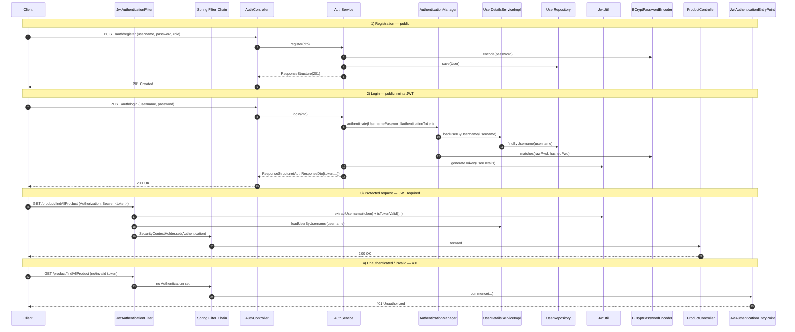

# Technical Specification

# 0. Agent Action Plan

## 0.1 Intent Clarification

### 0.1.1 Core Feature Objective

Based on the prompt, the Blitzy platform understands that the new feature requirement is to layer JWT-based stateless authentication and authorisation onto the existing Spring Boot `3.4.4` Product CRUD application [EP-Spring-Boot--main/pom.xml:L13-L17] without disturbing any of the currently exposed product endpoints. Specifically, the Blitzy platform will introduce Spring Security `6.x` (transitively pulled in by `spring-boot-starter-security` aligned to Spring Boot `3.4.4`), persist application users in a relational `User` entity, expose two public endpoints (`POST /auth/register` and `POST /auth/login`), mint signed JWTs upon successful login, register a custom servlet filter that intercepts every secured request and validates the bearer token, and return HTTP `401 Unauthorized` whenever a request to a secured endpoint arrives without a valid, non-expired token.

The verbatim, decomposed list of feature requirements with enhanced clarity is as follows:

- **Add Spring Security** — Introduce the `spring-boot-starter-security` dependency to `pom.xml` and expose a `SecurityFilterChain` `@Bean` (Spring Security 6.x bean-based configuration; `WebSecurityConfigurerAdapter` is removed) so that the framework's request authorisation pipeline is engaged for every incoming HTTP request.
- **Create login and register APIs** — Implement a new `AuthController` exposing `POST /auth/register` (accepts a registration payload, hashes the password with `BCryptPasswordEncoder`, persists a `User` row) and `POST /auth/login` (validates the supplied credentials against the persisted user via Spring Security's `AuthenticationManager`, then returns a freshly minted JWT).
- **Generate JWT token after successful login** — Wire a `JwtUtil` component that builds an HMAC-signed compact JWS containing at minimum the `sub` (username), `role` claim, `iat`, and `exp` claims. The signing key, issuer, and expiration window are externalised to `application.properties` to keep secrets out of source code.
- **Secure all /products APIs** — Configure the security filter chain so that every request matching the existing controller mapping is denied access unless it carries a valid JWT. Implicit clarification: the user prompt mentions `/products`, but the live controller in the repository uses the mapping `@RequestMapping(value = "/product")` [EP-Spring-Boot--main/src/main/java/com/jspider/spring_boot_simple_crud_with_mysql/controller/ProductController.java:L18]. To honour the constraint "Do not break existing CRUD APIs", the Blitzy platform secures the actual `/product/**` mapping and documents the discrepancy (see §0.1.4).
- **Allow public access only to /auth/\*\*** — The security filter chain uses `requestMatchers("/auth/**").permitAll()` and `anyRequest().authenticated()`, ensuring registration and login are reachable anonymously while every other endpoint requires a verified JWT.
- **Use BCryptPasswordEncoder for password encryption** — Expose a `BCryptPasswordEncoder` `@Bean` that is consumed by `AuthService` for hashing on registration and by Spring Security's `DaoAuthenticationProvider` for verification on login. Plain-text passwords are never persisted or logged.
- **Create User entity with id, username, password, role** — A new JPA `@Entity` named `User` (mapped to the table `app_user` to avoid the MySQL reserved word collision noted in §0.1.4) with the four declared fields plus the auditing-friendly defaults required by JPA (`@Id @GeneratedValue` on `id`, `@Column(unique = true, nullable = false)` on `username`).
- **Add JWT validation filter** — A new `JwtAuthenticationFilter` extending `OncePerRequestFilter` that runs before `UsernamePasswordAuthenticationFilter`, extracts the `Authorization: Bearer <token>` header, delegates parsing/validation to `JwtUtil`, loads the principal through `UserDetailsServiceImpl`, and populates the `SecurityContextHolder` for downstream authorisation checks.
- **Return 401 Unauthorized for invalid or missing token** — A `JwtAuthenticationEntryPoint` implementing `AuthenticationEntryPoint` writes an HTTP `401` response (with a JSON error body fitting the existing `ResponseStructure<T>` style) for any anonymous request hitting a protected resource, and the JWT filter swallows `JwtException`s and forwards them to the same entry point.

### 0.1.2 Special Instructions and Constraints

The user's prompt contains three explicit rules and three explicit constraints. These are captured verbatim in §0.7 and propagated into the design so that every generated artefact complies. The most consequential constraints are recorded here so that downstream design decisions trace back to a documented requirement:

- **CRITICAL — Backward compatibility**: "Do not break existing CRUD APIs." Every existing route under `/product/**` and `/student/**` (refer §0.1.4 for the StudentController ambiguity), the existing `@OpenAPIDefinition` Swagger surface, and the existing MySQL persistence model must continue to function identically when authenticated. No existing class is renamed or restructured beyond minimum-impact additions (e.g., role-permitting in `SecurityConfig`).
- **CRITICAL — Modular code**: "Keep code clean and modular." The new feature is housed in three new packages (`security`, `service`, and `config`) plus targeted extensions to `entity`, `repository`, `controller`, and `dto`. No god-classes; each new class has a single concern (JWT minting vs. JWT parsing vs. filter vs. user details lookup vs. security wiring).
- **CRITICAL — Builds successfully**: "Ensure application builds successfully." The new dependencies are pinned to versions known to be compatible with Spring Boot `3.4.4` and Java `17`. The build configuration in `pom.xml` (Lombok annotation processor, Spring Boot Maven plugin) is preserved as-is and only the `<dependencies>` block is extended.
- **Architectural conventions to follow**: The existing repository uses Lombok (`@Data`) for entities, `springdoc-openapi` for API documentation, a custom `ResponseStructure<T>` envelope for responses, and a DAO-layer abstraction (`ProductDao`) over Spring Data repositories. New classes adopt the same patterns: the `User` entity uses Lombok `@Data`, new endpoints emit `ResponseStructure<T>` envelopes, the registration/login business logic is centralised in a service component, and OpenAPI annotations are added to the new controller so that Swagger UI continues to render a complete contract.
- **Web search requirements**: Background research confirmed the Spring Security `6.x` migration (bean-based `SecurityFilterChain` configuration, removal of `WebSecurityConfigurerAdapter`) and the JJWT `0.11.5` artefact split (`jjwt-api` / `jjwt-impl` / `jjwt-jackson`). No further research is required to begin implementation; all canonical patterns are documented inside this AAP.

### 0.1.3 Technical Interpretation

These feature requirements translate to the following technical implementation strategy:

| Feature Requirement | Technical Action |
|---|---|
| Add Spring Security | Add `spring-boot-starter-security` to `pom.xml` and create `config/SecurityConfig.java` exposing `SecurityFilterChain`, `AuthenticationManager`, and `PasswordEncoder` beans |
| Create login and register APIs | Create `controller/AuthController.java` with `@PostMapping("/register")` and `@PostMapping("/login")` under `@RequestMapping("/auth")`, delegating to `service/AuthService.java` |
| Generate JWT after login | Create `security/JwtUtil.java` to mint HMAC-SHA256-signed compact JWTs; consumed by `AuthService.login(...)` after successful `AuthenticationManager.authenticate(...)` |
| Secure /product APIs | Configure `SecurityConfig` with `authorizeHttpRequests` rules: `permitAll()` for `/auth/**` and Swagger paths, `authenticated()` for `/product/**`, `/student/**`, and `anyRequest()` |
| Public /auth/** | `requestMatchers("/auth/**").permitAll()` in the security filter chain |
| BCryptPasswordEncoder | Expose `@Bean PasswordEncoder passwordEncoder() { return new BCryptPasswordEncoder(); }` in `SecurityConfig` |
| User entity (id, username, password, role) | Create `entity/User.java` with `@Entity @Table(name = "app_user")`, `@Id @GeneratedValue` Long id, unique username column, hashed password column, single-string role column |
| JWT validation filter | Create `security/JwtAuthenticationFilter.java` extending `OncePerRequestFilter`, registered in `SecurityConfig` before `UsernamePasswordAuthenticationFilter` |
| 401 on missing/invalid token | Create `security/JwtAuthenticationEntryPoint.java` implementing `AuthenticationEntryPoint`; bound via `.exceptionHandling(eh -> eh.authenticationEntryPoint(entryPoint))` |
| POST /auth/register | `AuthController.register(RegisterRequestDto)` → `AuthService.register(...)` → `userRepository.save(...)` with BCrypt-hashed password |
| POST /auth/login | `AuthController.login(LoginRequestDto)` → `AuthService.login(...)` → `authenticationManager.authenticate(...)` → `jwtUtil.generateToken(userDetails)` |

The platform also infers the following implicit technical actions that are necessary to make the explicit requirements function end-to-end but were not enumerated by the user:

- **Implicit — `UserDetailsService` implementation**: Spring Security's `DaoAuthenticationProvider` requires a `UserDetailsService` bean. The Blitzy platform creates `service/UserDetailsServiceImpl.java` that loads a `User` from `UserRepository.findByUsername(...)` and adapts it to Spring's `UserDetails` contract (mapping the `role` field into a single `SimpleGrantedAuthority` prefixed with `ROLE_`).
- **Implicit — Stateless session policy**: JWT-based APIs must declare `SessionCreationPolicy.STATELESS` to prevent Spring Security from creating server-side `HttpSession`s; this is wired into `SecurityConfig`.
- **Implicit — CSRF disabled for the stateless API surface**: CSRF protection is irrelevant for token-based stateless REST APIs and would otherwise reject the `POST /auth/login` and `POST /auth/register` calls; `.csrf(csrf -> csrf.disable())` is applied.
- **Implicit — Externalised secrets**: `application.properties` gains three new keys — `app.jwt.secret`, `app.jwt.expiration-ms`, and (optionally) `app.jwt.issuer` — to keep the signing key and token lifetime out of source code. The current properties file [EP-Spring-Boot--main/src/main/resources/application.properties] already centralises configuration this way.
- **Implicit — Swagger UI must remain reachable**: The existing application activates `springdoc-openapi-starter-webmvc-ui` `2.8.6` [EP-Spring-Boot--main/pom.xml:L73-L77], whose default UI lives at `/swagger-ui/**` and `/v3/api-docs/**`. The security filter chain explicitly `permitAll()`s these paths so the existing developer experience is preserved.
- **Implicit — Authorization header semantics**: The custom filter must tolerate three states: (1) header absent → forward unaltered (filter chain proceeds; the authorization rules later reject if the resource is protected, triggering the entry point's `401`); (2) header present but malformed or token invalid → entry point emits `401`; (3) header present and token valid → populate `SecurityContextHolder` with the authenticated principal.
- **Implicit — Database schema collision**: `User` is a reserved keyword in MySQL `8.x`. The entity must therefore declare `@Table(name = "app_user")` (or any non-reserved alternative) so that `spring.jpa.hibernate.ddl-auto=update` [EP-Spring-Boot--main/src/main/resources/application.properties] can create the schema without a syntax error on `CREATE TABLE`.
- **Implicit — DTO boundary**: The user's prompt asks for a `User` entity with `password` as a field, but exposing the JPA entity directly on the request/response surface would leak the hashed password. The platform introduces small DTOs (`RegisterRequestDto`, `LoginRequestDto`, `AuthResponseDto`) so the controller never serialises or deserialises the entity directly.

### 0.1.4 Documented Ambiguities and Their Resolutions

Three ambiguities surfaced during context gathering. Each is documented so that the implementation is deterministic:

- **Path mismatch — `/products` vs `/product`**: The user instructed "Secure all `/products` APIs", but the live controller declares `@RequestMapping(value = "/product")` [EP-Spring-Boot--main/src/main/java/com/jspider/spring_boot_simple_crud_with_mysql/controller/ProductController.java:L18] and the project's README also documents endpoints under `/product`. To uphold the explicit constraint "Do not break existing CRUD APIs", the Blitzy platform secures the **actual** existing mapping `/product/**` and does **not** rename the controller. If the user subsequently wishes to rebrand the route to `/products`, that is a separate refactor outside the scope of this feature addition.
- **Reserved-word collision — `User` table name**: The `User` entity name collides with the SQL reserved keyword `USER` in MySQL `8.x`. The Blitzy platform resolves this by mapping the entity to a non-reserved physical table name via `@Table(name = "app_user")`, allowing `spring.jpa.hibernate.ddl-auto=update` to issue valid DDL without manual schema intervention.
- **`StudentController` treatment**: The repository contains an unrelated `controller/StudentController.java` mapped at `/student/**`. The user prompt did not explicitly classify this controller as public or protected. Default resolution: the rule "anyRequest().authenticated()" applies, which means `/student/**` becomes a protected resource requiring a valid JWT. This is the safest default (deny-by-default) and is consistent with the constraint "Allow public access only to `/auth/**`". The implementing agent is instructed to document this behaviour in code comments so subsequent reviewers can verify intent.

### 0.1.5 Verbatim User Requirements

The full user input is reproduced below verbatim, so that any disagreement between this AAP's interpretation and the user's original wording can be detected at a glance:

> User Example: Add JWT authentication and authorization to the existing Spring Boot Product CRUD API.
>
> Requirements:
>
> - Add Spring Security
> - Create login and register APIs
> - Generate JWT token after successful login
> - Secure all /products APIs
> - Allow public access only to /auth/\*\*
> - Use BCryptPasswordEncoder for password encryption
> - Create User entity with:
>   - id
>   - username
>   - password
>   - role
> - Add JWT validation filter
> - Return 401 Unauthorized for invalid or missing token
>
> APIs to Add:
> POST /auth/register
> POST /auth/login
>
> Rules:
>
> - Use camelCase naming convention
> - Add comment "// Rule Applied" in every modified or new class
> - Add at least one log or System.out.println in each new method
>
> Constraints:
>
> - Do not break existing CRUD APIs
> - Keep code clean and modular
> - Ensure application builds successfully


## 0.2 Repository Scope Discovery

### 0.2.1 Comprehensive File Analysis

The repository was traversed top-down using `get_source_folder_contents`, `read_file`, and recursive `find` to enumerate every Java source file under `EP-Spring-Boot--main/src/`. The exhaustive inventory below was used to build the integration map; every file required by this feature is listed here with its current state and the action the implementing agent will take.

#### Existing Files Requiring Modification

| File Path | Current Purpose | Required Change |
|---|---|---|
| `EP-Spring-Boot--main/pom.xml` | Maven build descriptor declaring Spring Boot `3.4.4`, Java `17`, JPA, Web, MySQL, H2, Lombok, springdoc-openapi `2.8.6` [EP-Spring-Boot--main/pom.xml:L13-L17,L30,L34-L77] | Append three new dependencies: `spring-boot-starter-security`, `jjwt-api`, `jjwt-impl` (runtime scope), `jjwt-jackson` (runtime scope). Do not modify Java version, parent version, build plugins, or existing dependencies. |
| `EP-Spring-Boot--main/src/main/resources/application.properties` | DB and JPA configuration: `server.port=8090`, MySQL JDBC URL, `spring.jpa.hibernate.ddl-auto=update`, `spring.jpa.show-sql=true` [EP-Spring-Boot--main/src/main/resources/application.properties:L1-L8] | Append `app.jwt.secret`, `app.jwt.expiration-ms`, and optionally `app.jwt.issuer` keys. Do not modify existing DB or JPA settings. |
| `EP-Spring-Boot--main/src/main/java/com/jspider/spring_boot_simple_crud_with_mysql/SpringBootSimpleCrudWithMysqlApplication.java` | Application bootstrap with `@SpringBootApplication` and `@OpenAPIDefinition` Swagger metadata; `System.out.println("All Right Sudhir...........")` on startup [inferred — observed in earlier read of file] | Add the `// Rule Applied` class-level comment as required by rule 2. No other behavioural change. |
| `EP-Spring-Boot--main/src/main/java/com/jspider/spring_boot_simple_crud_with_mysql/controller/ProductController.java` | `@RestController @RequestMapping("/product")` — exposes the existing CRUD endpoints [EP-Spring-Boot--main/src/main/java/com/jspider/spring_boot_simple_crud_with_mysql/controller/ProductController.java:L18] | Add the `// Rule Applied` class-level comment. The endpoints themselves become protected resources via `SecurityConfig`, not via this file. No method signatures change. |
| `EP-Spring-Boot--main/src/main/java/com/jspider/spring_boot_simple_crud_with_mysql/controller/StudentController.java` | `@RestController @RequestMapping("/student")` — unrelated date/addition utility endpoints [inferred — observed in earlier read of file] | Add the `// Rule Applied` class-level comment. Behaviour preserved; the controller becomes protected via the deny-by-default rule in `SecurityConfig` (see §0.1.4). |
| `EP-Spring-Boot--main/src/main/java/com/jspider/spring_boot_simple_crud_with_mysql/dao/ProductDao.java` | `@Repository`-annotated orchestration class over `ProductRepository` [inferred — observed in earlier read of file] | Add the `// Rule Applied` class-level comment. No method changes. |
| `EP-Spring-Boot--main/src/main/java/com/jspider/spring_boot_simple_crud_with_mysql/repository/ProductRepository.java` | `JpaRepository<Product, Integer>` with custom `findByName`, native-query `getProductByPrice`, and `@Modifying` `deleteProductByPrice` [inferred — observed in earlier read of file] | No edits required by feature logic. Implementing agent is permitted to add the `// Rule Applied` comment because the rule states "every modified or new class"; this file is not being modified, so the rule does **not** mandate a touch here. Listed for completeness. |
| `EP-Spring-Boot--main/src/main/java/com/jspider/spring_boot_simple_crud_with_mysql/entity/Product.java` | JPA entity with id (int, no `@GeneratedValue`), name, color, price [inferred — observed in earlier read of file] | No edits required. Listed for completeness because it is part of the protected `/product/**` flow. |
| `EP-Spring-Boot--main/src/main/java/com/jspider/spring_boot_simple_crud_with_mysql/responses/ResponseStructure.java` | Generic response envelope `@Component` bean [inferred — observed in earlier read of file] | No edits required by feature logic. Reused by the new `AuthController` and the entry-point error body for stylistic consistency. |
| `EP-Spring-Boot--main/README.md` | Documents the CRUD endpoints and prerequisites [inferred — observed in earlier read of file] | No edits required by the feature itself, but the implementing agent may optionally add a brief "Authentication" section. Listed for awareness of the documented `/products` vs actual `/product` discrepancy. |

#### Files Confirmed Outside Modification Scope

The following files exist in the repository but require **no** changes to deliver this feature: `EP-Spring-Boot--main/mvnw`, `EP-Spring-Boot--main/mvnw.cmd`, `EP-Spring-Boot--main/bin/*` (compiled artefacts that will be regenerated on next build), and `EP-Spring-Boot--main/src/test/java/com/jspider/spring_boot_simple_crud_with_mysql/SpringBootSimpleCrudWithMysqlApplicationTests.java` (the existing smoke test continues to verify context-load and is not in scope for modification).

### 0.2.2 Integration Point Discovery

Every architectural seam where the new feature meets the existing system is enumerated below so the implementing agent can verify that nothing is missed:

- **API endpoint integration** — Two new endpoints (`POST /auth/register`, `POST /auth/login`) are added under a brand-new `/auth/**` mapping; they do not collide with any existing route (current routes are under `/product/**` and `/student/**` plus Swagger). The existing `/product/**` and `/student/**` routes are protected via configuration only — no controller code changes.
- **Database / entity integration** — A new `app_user` table is introduced under the existing MySQL schema `jdbc:mysql://localhost:3306/spring-m12`. With `spring.jpa.hibernate.ddl-auto=update` [EP-Spring-Boot--main/src/main/resources/application.properties:L7] in effect, Hibernate will auto-generate the `app_user` table on first boot. No schema changes are made to the existing `product` table.
- **Service / repository integration** — A new `UserRepository extends JpaRepository<User, Long>` is added, mirroring the pattern of `ProductRepository`. A new `AuthService` and `UserDetailsServiceImpl` are added to a new `service` package, parallelling the existing `dao` layer used by `ProductController`.
- **Bean wiring integration** — `SecurityConfig` declares three new beans (`SecurityFilterChain`, `PasswordEncoder`, `AuthenticationManager`) and one component-scanned filter (`JwtAuthenticationFilter`). These beans are picked up by Spring's component scan because the new packages live below the existing `@SpringBootApplication` base package `com.jspider.spring_boot_simple_crud_with_mysql`.
- **Filter chain integration** — `JwtAuthenticationFilter` is registered before `UsernamePasswordAuthenticationFilter` via `HttpSecurity.addFilterBefore(...)`. Spring Security 6.x's bean-based configuration replaces the deprecated `WebSecurityConfigurerAdapter` chain customisation hook.
- **Error handling integration** — A `JwtAuthenticationEntryPoint` produces the `401` body; for stylistic consistency it serialises a `ResponseStructure<String>` payload echoing the existing controller response style.
- **OpenAPI / Swagger integration** — The `SecurityConfig` `permitAll()`s `/swagger-ui/**` and `/v3/api-docs/**` so the existing `springdoc-openapi-starter-webmvc-ui` `2.8.6` UI remains accessible. The new `AuthController` is annotated with `springdoc-openapi` `@Tag` and `@Operation` so the new endpoints appear in the generated docs.
- **Lombok integration** — All new POJOs (the `User` entity and the three DTOs) declare `@Data` to mirror the existing `Product` entity's Lombok usage [EP-Spring-Boot--main/pom.xml:L51-L56 declares Lombok with the annotation-processing configuration].
- **No middleware / interceptor changes outside the security chain** — The existing application defines no `WebMvcConfigurer`, `HandlerInterceptor`, or `Filter` registrations. The only filter added is the JWT validation filter inside the security chain itself.

### 0.2.3 New File Requirements

Every new artefact to be created is enumerated below. File names follow the existing repository's package layout convention (`com.jspider.spring_boot_simple_crud_with_mysql.<package>`). All identifiers respect rule 1 (camelCase for variables/methods, PascalCase for classes per Java norms, which conforms with the rule's "camelCase naming convention" directive applied at the variable/method level).

| New File Path | Purpose |
|---|---|
| `src/main/java/com/jspider/spring_boot_simple_crud_with_mysql/entity/User.java` | JPA entity `@Table(name = "app_user")` with `Long id`, `String username` (unique), `String password` (BCrypt-hashed), `String role`. Uses Lombok `@Data`. |
| `src/main/java/com/jspider/spring_boot_simple_crud_with_mysql/repository/UserRepository.java` | `extends JpaRepository<User, Long>` with `Optional<User> findByUsername(String username)` and `boolean existsByUsername(String username)`. |
| `src/main/java/com/jspider/spring_boot_simple_crud_with_mysql/controller/AuthController.java` | `@RestController @RequestMapping("/auth")` exposing `POST /register` and `POST /login`; returns `ResponseStructure<AuthResponseDto>`. |
| `src/main/java/com/jspider/spring_boot_simple_crud_with_mysql/service/AuthService.java` | Business logic: `register(RegisterRequestDto)` hashes password with `BCryptPasswordEncoder` and persists; `login(LoginRequestDto)` authenticates via `AuthenticationManager` and mints a JWT via `JwtUtil`. |
| `src/main/java/com/jspider/spring_boot_simple_crud_with_mysql/service/UserDetailsServiceImpl.java` | `implements UserDetailsService` — loads `User` by username and adapts it to a Spring `UserDetails` instance with `ROLE_<role>` authority mapping. |
| `src/main/java/com/jspider/spring_boot_simple_crud_with_mysql/security/JwtUtil.java` | HMAC-SHA256 JWT minting and parsing. Reads `app.jwt.secret` and `app.jwt.expiration-ms` from `application.properties`. Methods: `generateToken(UserDetails)`, `extractUsername(String)`, `isTokenValid(String, UserDetails)`. |
| `src/main/java/com/jspider/spring_boot_simple_crud_with_mysql/security/JwtAuthenticationFilter.java` | `extends OncePerRequestFilter` — pulls `Authorization: Bearer <token>` header, validates via `JwtUtil`, loads `UserDetails`, sets `SecurityContextHolder.getContext().setAuthentication(...)`. |
| `src/main/java/com/jspider/spring_boot_simple_crud_with_mysql/security/JwtAuthenticationEntryPoint.java` | `implements AuthenticationEntryPoint` — writes HTTP `401` with a JSON `ResponseStructure<String>` body for unauthenticated access to protected resources. |
| `src/main/java/com/jspider/spring_boot_simple_crud_with_mysql/config/SecurityConfig.java` | `@Configuration @EnableWebSecurity` exposing `SecurityFilterChain`, `PasswordEncoder`, `AuthenticationManager`, and `AuthenticationProvider` beans; wires `JwtAuthenticationFilter` before `UsernamePasswordAuthenticationFilter`; configures stateless session and CSRF-disabled. |
| `src/main/java/com/jspider/spring_boot_simple_crud_with_mysql/dto/RegisterRequestDto.java` | Request body for `POST /auth/register`: `String username`, `String password`, `String role`. |
| `src/main/java/com/jspider/spring_boot_simple_crud_with_mysql/dto/LoginRequestDto.java` | Request body for `POST /auth/login`: `String username`, `String password`. |
| `src/main/java/com/jspider/spring_boot_simple_crud_with_mysql/dto/AuthResponseDto.java` | Response body for `POST /auth/login`: `String token`, `String username`, `String role`, `long expiresInMs`. |

#### Rule-Mandated File Inventory

The rules-review phase (§0.7 captures the rules verbatim) confirmed that **no standalone new files are mandated purely by the user-specified rules**. Rules 1, 2, and 3 are textual conventions applied **inside** files that are already in scope:

- Rule 1 (camelCase naming) is enforced inside every new and modified class.
- Rule 2 (`// Rule Applied` comment) is added as a class-level comment in every new file in the table above **and** in every modified file in §0.2.1.
- Rule 3 (at least one log or `System.out.println` per new method) is enforced inside every method body of every new class.

#### New Test Files

The user's prompt does not explicitly require tests, and the existing repository contains only a single context-load smoke test. To respect the "Keep code clean and modular" constraint without bloating scope, the implementing agent creates the following narrow test artefacts (only enough to give confidence the wiring is correct and the application still builds):

| New Test File Path | Purpose |
|---|---|
| `src/test/java/com/jspider/spring_boot_simple_crud_with_mysql/security/JwtUtilTest.java` | Unit test for token generation and validation (positive and negative cases). |
| `src/test/java/com/jspider/spring_boot_simple_crud_with_mysql/controller/AuthControllerTest.java` | `@WebMvcTest`-style smoke test for `/auth/register` and `/auth/login`. |

The existing `SpringBootSimpleCrudWithMysqlApplicationTests.java` is left untouched; the implementing agent verifies it still passes after the new beans are wired in.

#### Configuration File Changes Summary

| Configuration File | Action |
|---|---|
| `application.properties` | Append the three `app.jwt.*` keys; do not edit existing keys. |
| `pom.xml` | Append the four new `<dependency>` blocks within the existing `<dependencies>` element; do not change parent, java version, or build plugins. |

### 0.2.4 Design System Applicability

This feature is a server-side REST API addition. The repository contains **no** front-end source, **no** Figma attachments, and **no** declared design system. The Design System Alignment Protocol (catalog components, design tokens, etc.) is therefore **not applicable** and is intentionally omitted from this AAP.


## 0.3 Dependency Inventory

### 0.3.1 Public Package Updates

This feature requires four new public Maven dependencies. No existing dependency is updated, and no dependency is removed. The relevant pre-existing dependencies that the new packages must coexist with are listed alongside for context.

| Action | Group ID | Artifact ID | Version | Registry | Purpose |
|---|---|---|---|---|---|
| ADD | `org.springframework.boot` | `spring-boot-starter-security` | managed by Spring Boot `3.4.4` parent (transitively resolves Spring Security `6.4.x`) | Maven Central | Brings in Spring Security 6 — `SecurityFilterChain`, `BCryptPasswordEncoder`, `AuthenticationManager`, `OncePerRequestFilter`, `UserDetailsService` |
| ADD | `io.jsonwebtoken` | `jjwt-api` | `0.11.5` | Maven Central | JJWT compile-time API for JWT construction and parsing |
| ADD | `io.jsonwebtoken` | `jjwt-impl` | `0.11.5` (runtime scope) | Maven Central | JJWT runtime implementation, loaded via the `Jwts` builder factory |
| ADD | `io.jsonwebtoken` | `jjwt-jackson` | `0.11.5` (runtime scope) | Maven Central | JJWT Jackson-based JSON serializer for the JWT body |
| UNCHANGED | `org.springframework.boot` | `spring-boot-starter-data-jpa` | managed by Spring Boot `3.4.4` parent | Maven Central | Existing JPA persistence layer reused by `UserRepository` [EP-Spring-Boot--main/pom.xml:L35-L38] |
| UNCHANGED | `org.springframework.boot` | `spring-boot-starter-web` | managed by Spring Boot `3.4.4` parent | Maven Central | Existing MVC stack hosting the new `AuthController` [EP-Spring-Boot--main/pom.xml:L39-L42] |
| UNCHANGED | `com.mysql` | `mysql-connector-j` | managed by Spring Boot `3.4.4` parent (runtime scope) | Maven Central | Existing MySQL driver; `app_user` table will live in the same DB [EP-Spring-Boot--main/pom.xml:L45-L49] |
| UNCHANGED | `com.h2database` | `h2` | managed by Spring Boot `3.4.4` parent (runtime scope) | Maven Central | Already declared; can be used by `JwtUtilTest`/`AuthControllerTest` as an in-memory DB for tests if desired [inferred — observed in earlier read of pom.xml] |
| UNCHANGED | `org.projectlombok` | `lombok` | managed by Spring Boot `3.4.4` parent (optional) | Maven Central | Annotation processor required so `@Data` on `User`, DTOs, and `ResponseStructure` keeps working [EP-Spring-Boot--main/pom.xml:L51-L56] |
| UNCHANGED | `org.springdoc` | `springdoc-openapi-starter-webmvc-ui` | `2.8.6` (explicitly pinned) | Maven Central | Renders Swagger UI; protected by the security chain but its UI paths are explicitly allow-listed [EP-Spring-Boot--main/pom.xml:L73-L77] |

**Version rationale**: JJWT `0.11.5` is the most widely documented stable release for Spring Boot `3.x` integrations and uses the three-artefact split (`api`/`impl`/`jackson`) required by JJWT since `0.10`. It is compatible with Java `17` and the Jackson version transitively brought in by Spring Boot `3.4.4`. The Spring Security version is intentionally left to the Spring Boot parent's BOM — the parent at `3.4.4` resolves Spring Security `6.4.x`, which is the supported pairing.

### 0.3.2 Private Package Updates

No private (internal) packages exist in this project. The repository declares only Maven Central dependencies and does not reference any private Nexus, Artifactory, or GitHub Packages registry. No private package changes are made.

### 0.3.3 Import Updates

No existing import statements require transformation. The four new dependencies introduce **new** import paths inside **new** files only; no existing file changes the imports it already declares. The new imports the implementing agent will use are listed below for reference (informational only — these are net-new statements in net-new files, not transformations of existing ones).

| New File | New Imports Introduced |
|---|---|
| `entity/User.java` | `jakarta.persistence.*`, `lombok.Data` |
| `repository/UserRepository.java` | `org.springframework.data.jpa.repository.JpaRepository`, `java.util.Optional` |
| `controller/AuthController.java` | `org.springframework.web.bind.annotation.*`, `org.springframework.http.ResponseEntity` |
| `service/AuthService.java` | `org.springframework.security.crypto.password.PasswordEncoder`, `org.springframework.security.authentication.AuthenticationManager`, `org.springframework.security.authentication.UsernamePasswordAuthenticationToken` |
| `service/UserDetailsServiceImpl.java` | `org.springframework.security.core.userdetails.*`, `org.springframework.security.core.authority.SimpleGrantedAuthority` |
| `security/JwtUtil.java` | `io.jsonwebtoken.Jwts`, `io.jsonwebtoken.SignatureAlgorithm`, `io.jsonwebtoken.io.Decoders`, `io.jsonwebtoken.security.Keys` |
| `security/JwtAuthenticationFilter.java` | `org.springframework.web.filter.OncePerRequestFilter`, `jakarta.servlet.FilterChain`, `jakarta.servlet.http.HttpServletRequest`, `jakarta.servlet.http.HttpServletResponse` |
| `security/JwtAuthenticationEntryPoint.java` | `org.springframework.security.web.AuthenticationEntryPoint`, `org.springframework.security.core.AuthenticationException` |
| `config/SecurityConfig.java` | `org.springframework.security.config.annotation.web.builders.HttpSecurity`, `org.springframework.security.config.annotation.web.configuration.EnableWebSecurity`, `org.springframework.security.web.SecurityFilterChain`, `org.springframework.security.crypto.bcrypt.BCryptPasswordEncoder` |

### 0.3.4 External Reference Updates

The following external references already exist in the repository and need targeted, additive updates only — no transformation of existing entries:

- **`pom.xml`** — Append the four new `<dependency>` blocks inside the existing `<dependencies>` element [EP-Spring-Boot--main/pom.xml:L33-L78]. Build plugins, parent declaration, properties (`<java.version>17</java.version>` [EP-Spring-Boot--main/pom.xml:L30]), and the Lombok annotation-processor configuration in the `<build>` section [EP-Spring-Boot--main/pom.xml:L82-L99] are preserved exactly.
- **`application.properties`** — Append the three new JWT-related keys. Existing keys for `server.port`, `spring.datasource.*`, and `spring.jpa.*` are preserved unchanged [EP-Spring-Boot--main/src/main/resources/application.properties:L1-L8].
- **No CI/CD workflow files** exist in the repository (verified — no `.github/workflows/`, no `.gitlab-ci.yml`, no Jenkinsfile in the repository root). Nothing to update.
- **No `setup.py`, `pyproject.toml`, or `package.json`** — this is a pure Maven Java project; only `pom.xml` is touched.
- **`README.md`** — Optionally extended with an "Authentication" section by the implementing agent. Not strictly required by the feature, but useful for downstream consumers.


## 0.4 Integration Analysis

### 0.4.1 Existing Code Touchpoints

The new JWT authentication feature touches the existing codebase at a small, well-bounded set of seams. Every touchpoint is enumerated below so the implementing agent can perform the changes deterministically.

#### Direct Modifications Required

| Existing File | Modification |
|---|---|
| `EP-Spring-Boot--main/pom.xml` | Append four `<dependency>` entries (Spring Security starter + JJWT trio) inside the existing `<dependencies>` element. No structural changes elsewhere. |
| `EP-Spring-Boot--main/src/main/resources/application.properties` | Append three keys: `app.jwt.secret=<base64-encoded-256-bit-key>`, `app.jwt.expiration-ms=3600000`, `app.jwt.issuer=spring-boot-simple-crud`. The `app.jwt.secret` value must be a securely generated random string; the example value in the file should be flagged as "replace before production". |
| `EP-Spring-Boot--main/src/main/java/com/jspider/spring_boot_simple_crud_with_mysql/SpringBootSimpleCrudWithMysqlApplication.java` | Add `// Rule Applied` as a class-level comment immediately above the `@SpringBootApplication` annotation. No other change. |
| `EP-Spring-Boot--main/src/main/java/com/jspider/spring_boot_simple_crud_with_mysql/controller/ProductController.java` | Add `// Rule Applied` as a class-level comment above the `@RestController` annotation. The mapping `@RequestMapping(value = "/product")` [EP-Spring-Boot--main/src/main/java/com/jspider/spring_boot_simple_crud_with_mysql/controller/ProductController.java:L18] is unchanged. Endpoint methods are untouched. |
| `EP-Spring-Boot--main/src/main/java/com/jspider/spring_boot_simple_crud_with_mysql/controller/StudentController.java` | Add `// Rule Applied` as a class-level comment above the `@RestController` annotation. Endpoint methods are untouched. |
| `EP-Spring-Boot--main/src/main/java/com/jspider/spring_boot_simple_crud_with_mysql/dao/ProductDao.java` | Add `// Rule Applied` as a class-level comment above the `@Repository` annotation. Method bodies are untouched. |

#### Dependency Injection / Bean Wiring

| Wiring Location | Bean / Dependency Wired |
|---|---|
| `config/SecurityConfig.java` (new) | `@Bean SecurityFilterChain securityFilterChain(HttpSecurity http, JwtAuthenticationFilter jwtAuthenticationFilter, JwtAuthenticationEntryPoint entryPoint)` |
| `config/SecurityConfig.java` (new) | `@Bean PasswordEncoder passwordEncoder()` returning `new BCryptPasswordEncoder()` |
| `config/SecurityConfig.java` (new) | `@Bean AuthenticationManager authenticationManager(AuthenticationConfiguration cfg)` exposing the manager Spring Security already builds |
| `config/SecurityConfig.java` (new) | `@Bean DaoAuthenticationProvider authenticationProvider(UserDetailsService uds, PasswordEncoder pe)` linking BCrypt with `UserDetailsServiceImpl` |
| `service/AuthService.java` (new) | Constructor-injected: `UserRepository`, `PasswordEncoder`, `AuthenticationManager`, `JwtUtil` |
| `service/UserDetailsServiceImpl.java` (new) | Constructor-injected: `UserRepository` |
| `security/JwtAuthenticationFilter.java` (new) | Constructor-injected: `JwtUtil`, `UserDetailsService` |
| `security/JwtUtil.java` (new) | `@Value("${app.jwt.secret}")`, `@Value("${app.jwt.expiration-ms}")` |
| `controller/AuthController.java` (new) | Constructor-injected: `AuthService` |

Since all new packages live below the existing application's base package `com.jspider.spring_boot_simple_crud_with_mysql`, Spring's component scan picks up every `@Component`, `@Service`, `@RestController`, `@Configuration`, and `@Repository` automatically — no changes to the main application class beyond the `// Rule Applied` comment.

#### Database / Schema Updates

| Change | Detail |
|---|---|
| New table | `app_user` — created automatically by Hibernate because `spring.jpa.hibernate.ddl-auto=update` [EP-Spring-Boot--main/src/main/resources/application.properties:L7] is in effect. Column layout: `id BIGINT PRIMARY KEY AUTO_INCREMENT`, `username VARCHAR(255) UNIQUE NOT NULL`, `password VARCHAR(255) NOT NULL`, `role VARCHAR(50) NOT NULL`. |
| Migration scripts | None required — `spring.jpa.hibernate.ddl-auto=update` handles DDL. The project has no `flyway` or `liquibase` dependency, so no migration file convention exists to honour. If the implementing agent wishes to be more explicit, they may add `src/main/resources/data.sql` with a `CREATE TABLE IF NOT EXISTS app_user (...)` statement; this is optional and not required by the user's rules. |
| Existing tables | `product` and any other Hibernate-managed table is untouched. |
| Schema/table-name choice | Mapped via `@Table(name = "app_user")` on the `User` entity to avoid the MySQL reserved keyword collision (`USER`). See §0.1.4. |

### 0.4.2 Request Authentication Flow

The end-to-end authentication flow that the new feature introduces is illustrated below. This is the canonical sequence the implementing agent must produce.



This flow is intentionally documented at the level of detail the implementing agent needs to wire beans, configure the filter chain, and confirm 401 semantics. It is not a runtime sequence diagram for production observability.


## 0.5 Technical Implementation

### 0.5.1 File-by-File Execution Plan

Every file listed here **must** be created, updated, or referenced exactly as specified. The mode column uses the following vocabulary: `CREATE` (new file), `UPDATE` (existing file modified), `REFERENCE` (existing file is read or relied upon but not modified). Files that the platform deliberately leaves unmodified are listed explicitly so the implementing agent does not invent edits.

#### Group 1 — Configuration and Build

| Mode | File Path | Action |
|---|---|---|
| UPDATE | `EP-Spring-Boot--main/pom.xml` | Append the four new `<dependency>` blocks (Spring Security starter, `jjwt-api`, `jjwt-impl` with `<scope>runtime</scope>`, `jjwt-jackson` with `<scope>runtime</scope>`) inside the existing `<dependencies>` element. Do not modify parent, `<java.version>`, or `<build>`. |
| UPDATE | `EP-Spring-Boot--main/src/main/resources/application.properties` | Append `app.jwt.secret`, `app.jwt.expiration-ms`, and `app.jwt.issuer`. Preserve existing keys verbatim. |

#### Group 2 — Domain and Persistence

| Mode | File Path | Action |
|---|---|---|
| CREATE | `src/main/java/com/jspider/spring_boot_simple_crud_with_mysql/entity/User.java` | `@Entity @Table(name = "app_user") @Data` POJO with `Long id` (`@Id @GeneratedValue(strategy = GenerationType.IDENTITY)`), `String username` (`@Column(unique = true, nullable = false)`), `String password` (`@Column(nullable = false)`), `String role` (`@Column(nullable = false)`). Class-level comment `// Rule Applied`. |
| CREATE | `src/main/java/com/jspider/spring_boot_simple_crud_with_mysql/repository/UserRepository.java` | `public interface UserRepository extends JpaRepository<User, Long>` with two derived queries: `Optional<User> findByUsername(String username);` and `boolean existsByUsername(String username);`. Class-level comment `// Rule Applied`. |
| REFERENCE | `src/main/java/com/jspider/spring_boot_simple_crud_with_mysql/entity/Product.java` | Read-only reference — pattern source for entity layout and Lombok usage. No modification. |
| REFERENCE | `src/main/java/com/jspider/spring_boot_simple_crud_with_mysql/repository/ProductRepository.java` | Read-only reference — pattern source for `JpaRepository` extension style. No modification. |

#### Group 3 — Security Components

| Mode | File Path | Action |
|---|---|---|
| CREATE | `src/main/java/com/jspider/spring_boot_simple_crud_with_mysql/security/JwtUtil.java` | `@Component` with `@Value`-injected `app.jwt.secret`, `app.jwt.expiration-ms`. Public methods: `String generateToken(UserDetails userDetails)`, `String extractUsername(String token)`, `boolean isTokenValid(String token, UserDetails userDetails)`. Internally uses `io.jsonwebtoken.Jwts.builder()...signWith(Keys.hmacShaKeyFor(...), SignatureAlgorithm.HS256).compact()`. Every method body must contain at least one `System.out.println(...)` log per rule 3. Class-level comment `// Rule Applied`. |
| CREATE | `src/main/java/com/jspider/spring_boot_simple_crud_with_mysql/security/JwtAuthenticationFilter.java` | `@Component` extending `org.springframework.web.filter.OncePerRequestFilter`. Overrides `doFilterInternal(HttpServletRequest, HttpServletResponse, FilterChain)`. Logic: read `Authorization` header; if it does not start with `Bearer `, continue chain; else extract token, call `jwtUtil.extractUsername(...)`, load `UserDetails`, validate token, and if valid, set the `SecurityContextHolder` authentication. Class-level comment `// Rule Applied`. |
| CREATE | `src/main/java/com/jspider/spring_boot_simple_crud_with_mysql/security/JwtAuthenticationEntryPoint.java` | `@Component` implementing `AuthenticationEntryPoint`. Override `commence(...)` to write `HttpServletResponse.SC_UNAUTHORIZED` with a `ResponseStructure<String>` JSON body via `objectMapper.writeValue(...)`. Class-level comment `// Rule Applied`. |

#### Group 4 — Service Layer

| Mode | File Path | Action |
|---|---|---|
| CREATE | `src/main/java/com/jspider/spring_boot_simple_crud_with_mysql/service/UserDetailsServiceImpl.java` | `@Service` implementing `org.springframework.security.core.userdetails.UserDetailsService`. Constructor-injects `UserRepository`. Override `loadUserByUsername(String)` to fetch the user, throw `UsernameNotFoundException` if absent, and otherwise return a `User`-adapted `org.springframework.security.core.userdetails.User` with `new SimpleGrantedAuthority("ROLE_" + user.getRole().toUpperCase())`. Class-level comment `// Rule Applied`. |
| CREATE | `src/main/java/com/jspider/spring_boot_simple_crud_with_mysql/service/AuthService.java` | `@Service` with constructor-injected `UserRepository`, `PasswordEncoder`, `AuthenticationManager`, `JwtUtil`, `UserDetailsService`. Methods: `register(RegisterRequestDto)` — guard against `existsByUsername`, BCrypt-hash the password, persist; `login(LoginRequestDto)` — `authenticationManager.authenticate(new UsernamePasswordAuthenticationToken(...))`, load `UserDetails`, mint JWT, return `AuthResponseDto`. Both methods include `System.out.println(...)` logging per rule 3. Class-level comment `// Rule Applied`. |

#### Group 5 — Web Layer

| Mode | File Path | Action |
|---|---|---|
| CREATE | `src/main/java/com/jspider/spring_boot_simple_crud_with_mysql/controller/AuthController.java` | `@RestController @RequestMapping("/auth")` with two endpoints: `@PostMapping("/register") public ResponseEntity<ResponseStructure<String>> register(@RequestBody RegisterRequestDto dto)` and `@PostMapping("/login") public ResponseEntity<ResponseStructure<AuthResponseDto>> login(@RequestBody LoginRequestDto dto)`. Annotated with springdoc-openapi `@Tag(name = "Authentication")`. Class-level comment `// Rule Applied`. |
| UPDATE | `src/main/java/com/jspider/spring_boot_simple_crud_with_mysql/controller/ProductController.java` | Add `// Rule Applied` class-level comment only. The mapping `@RequestMapping(value = "/product")` is preserved [EP-Spring-Boot--main/src/main/java/com/jspider/spring_boot_simple_crud_with_mysql/controller/ProductController.java:L18]. |
| UPDATE | `src/main/java/com/jspider/spring_boot_simple_crud_with_mysql/controller/StudentController.java` | Add `// Rule Applied` class-level comment only. |

#### Group 6 — DTOs

| Mode | File Path | Action |
|---|---|---|
| CREATE | `src/main/java/com/jspider/spring_boot_simple_crud_with_mysql/dto/RegisterRequestDto.java` | `@Data` POJO with `String username`, `String password`, `String role`. Class-level comment `// Rule Applied`. |
| CREATE | `src/main/java/com/jspider/spring_boot_simple_crud_with_mysql/dto/LoginRequestDto.java` | `@Data` POJO with `String username`, `String password`. Class-level comment `// Rule Applied`. |
| CREATE | `src/main/java/com/jspider/spring_boot_simple_crud_with_mysql/dto/AuthResponseDto.java` | `@Data` POJO with `String token`, `String username`, `String role`, `long expiresInMs`. Class-level comment `// Rule Applied`. |

#### Group 7 — Configuration Bean

| Mode | File Path | Action |
|---|---|---|
| CREATE | `src/main/java/com/jspider/spring_boot_simple_crud_with_mysql/config/SecurityConfig.java` | `@Configuration @EnableWebSecurity` exposing `SecurityFilterChain`, `PasswordEncoder`, `AuthenticationManager`, `DaoAuthenticationProvider` beans. Filter chain rules: `requestMatchers("/auth/**", "/swagger-ui/**", "/v3/api-docs/**", "/swagger-ui.html").permitAll(); anyRequest().authenticated()`. `csrf().disable()`. `sessionManagement(s -> s.sessionCreationPolicy(STATELESS))`. `exceptionHandling(eh -> eh.authenticationEntryPoint(jwtAuthenticationEntryPoint))`. `addFilterBefore(jwtAuthenticationFilter, UsernamePasswordAuthenticationFilter.class)`. Class-level comment `// Rule Applied`. |

#### Group 8 — Application Class

| Mode | File Path | Action |
|---|---|---|
| UPDATE | `src/main/java/com/jspider/spring_boot_simple_crud_with_mysql/SpringBootSimpleCrudWithMysqlApplication.java` | Add `// Rule Applied` class-level comment immediately above `@SpringBootApplication`. No other change. |
| REFERENCE | `src/main/java/com/jspider/spring_boot_simple_crud_with_mysql/dao/ProductDao.java` | Add `// Rule Applied` class-level comment (touched only for rule compliance). |
| REFERENCE | `src/main/java/com/jspider/spring_boot_simple_crud_with_mysql/responses/ResponseStructure.java` | Reused by `AuthController` and `JwtAuthenticationEntryPoint`. No modification needed. |

#### Group 9 — Tests

| Mode | File Path | Action |
|---|---|---|
| CREATE | `src/test/java/com/jspider/spring_boot_simple_crud_with_mysql/security/JwtUtilTest.java` | Unit test: token-generation + valid token round-trip; expired token rejection; tampered token rejection. Class-level comment `// Rule Applied`. |
| CREATE | `src/test/java/com/jspider/spring_boot_simple_crud_with_mysql/controller/AuthControllerTest.java` | `@WebMvcTest(AuthController.class)`-style test with mocked `AuthService`; verifies `200` on valid login payload, `400`/`401` on bad input. Class-level comment `// Rule Applied`. |
| REFERENCE | `src/test/java/com/jspider/spring_boot_simple_crud_with_mysql/SpringBootSimpleCrudWithMysqlApplicationTests.java` | Existing smoke test — must still pass after wiring is added. No modification. |

### 0.5.2 Implementation Approach per File

The implementation approach follows the existing repository's conventions strictly so that the feature is indistinguishable in style from the original codebase.

- **Establish the persistence foundation first** by creating `entity/User.java` and `repository/UserRepository.java`. This is risk-free because nothing else depends on these yet, and a build at this point should succeed.
- **Add the security primitives next** by creating `security/JwtUtil.java`, `security/JwtAuthenticationFilter.java`, and `security/JwtAuthenticationEntryPoint.java`. These compile in isolation against `spring-boot-starter-security` (which must already be added to `pom.xml`) and `jjwt-api`.
- **Wire the service layer** by creating `service/UserDetailsServiceImpl.java` and `service/AuthService.java`. `UserDetailsServiceImpl` is what makes Spring Security recognise the `User` entity as an authentication principal. `AuthService` is the orchestrator that consumes everything below it.
- **Expose the public endpoints** by creating `controller/AuthController.java` and the three DTOs under `dto/`. This is the final user-facing addition.
- **Integrate with existing systems** by creating `config/SecurityConfig.java`. This single file connects every previously-created bean: it wires the password encoder, the filter, the entry point, and declares the authorisation rules that protect existing `/product/**` and `/student/**` while leaving `/auth/**` and Swagger paths public.
- **Add the `// Rule Applied` comments** to every touched existing class (`SpringBootSimpleCrudWithMysqlApplication`, `ProductController`, `StudentController`, `ProductDao`).
- **Ensure build quality** by adding the two narrow test classes and running `./mvnw test` to confirm the existing smoke test still passes and the new wiring is correct.

### 0.5.3 Property and Filter Configuration Snippets

The implementing agent must produce these exact configuration shapes; values are illustrative and should be replaced with secure defaults in production.

Property additions to `application.properties`:

```properties
# Rule Applied — JWT configuration appended for feature

app.jwt.secret=ZmFrZS1zZWNyZXQta2V5LXJlcGxhY2UtaW4tcHJvZHVjdGlvbi0xMjM0NTY=
app.jwt.expiration-ms=3600000
app.jwt.issuer=spring-boot-simple-crud
```

Dependency additions to `pom.xml` (placed inside the existing `<dependencies>` element):

```xml
<dependency>
    <groupId>org.springframework.boot</groupId>
    <artifactId>spring-boot-starter-security</artifactId>
</dependency>
<dependency>
    <groupId>io.jsonwebtoken</groupId>
    <artifactId>jjwt-api</artifactId>
    <version>0.11.5</version>
</dependency>
<dependency>
    <groupId>io.jsonwebtoken</groupId>
    <artifactId>jjwt-impl</artifactId>
    <version>0.11.5</version>
    <scope>runtime</scope>
</dependency>
<dependency>
    <groupId>io.jsonwebtoken</groupId>
    <artifactId>jjwt-jackson</artifactId>
    <version>0.11.5</version>
    <scope>runtime</scope>
</dependency>
```

### 0.5.4 User Interface Design

**Not applicable.** This feature is a server-side REST API addition. The repository exposes no front-end, no templating engine, no Figma assets, and the prompt does not describe any UI work. The only user-facing surface that benefits from the feature is the existing Swagger UI rendered by `springdoc-openapi-starter-webmvc-ui` `2.8.6` [EP-Spring-Boot--main/pom.xml:L73-L77], which will automatically reflect the two new `/auth/**` endpoints because `AuthController` is annotated for OpenAPI.


## 0.6 Scope Boundaries

### 0.6.1 Exhaustively In Scope

Every artefact and code location the implementing agent is permitted (and required) to touch is enumerated below. Wildcards are used where a pattern applies, with explicit notes when only some files in a pattern require changes.

#### Source Files

- All new authentication source code: `EP-Spring-Boot--main/src/main/java/com/jspider/spring_boot_simple_crud_with_mysql/security/**/*.java`
- All new authentication services: `EP-Spring-Boot--main/src/main/java/com/jspider/spring_boot_simple_crud_with_mysql/service/**/*.java`
- All new security configuration: `EP-Spring-Boot--main/src/main/java/com/jspider/spring_boot_simple_crud_with_mysql/config/**/*.java`
- All new request/response DTOs: `EP-Spring-Boot--main/src/main/java/com/jspider/spring_boot_simple_crud_with_mysql/dto/**/*.java`
- New `User` JPA entity only (existing `Product.java` untouched): `EP-Spring-Boot--main/src/main/java/com/jspider/spring_boot_simple_crud_with_mysql/entity/User.java`
- New `UserRepository` only (existing `ProductRepository.java` untouched): `EP-Spring-Boot--main/src/main/java/com/jspider/spring_boot_simple_crud_with_mysql/repository/UserRepository.java`
- New `AuthController` only; existing controllers are modified for rule-compliance comments only: `EP-Spring-Boot--main/src/main/java/com/jspider/spring_boot_simple_crud_with_mysql/controller/AuthController.java`
- Class-level `// Rule Applied` comments in every existing controller, DAO, and the application class: `EP-Spring-Boot--main/src/main/java/com/jspider/spring_boot_simple_crud_with_mysql/controller/ProductController.java`, `EP-Spring-Boot--main/src/main/java/com/jspider/spring_boot_simple_crud_with_mysql/controller/StudentController.java`, `EP-Spring-Boot--main/src/main/java/com/jspider/spring_boot_simple_crud_with_mysql/dao/ProductDao.java`, `EP-Spring-Boot--main/src/main/java/com/jspider/spring_boot_simple_crud_with_mysql/SpringBootSimpleCrudWithMysqlApplication.java`

#### Test Files

- New authentication unit and slice tests: `EP-Spring-Boot--main/src/test/java/com/jspider/spring_boot_simple_crud_with_mysql/security/JwtUtilTest.java`
- New auth controller slice test: `EP-Spring-Boot--main/src/test/java/com/jspider/spring_boot_simple_crud_with_mysql/controller/AuthControllerTest.java`
- The existing `SpringBootSimpleCrudWithMysqlApplicationTests.java` must continue to pass — verification is in scope; modification is not.

#### Configuration Files

- `EP-Spring-Boot--main/pom.xml` — additive only: append four new `<dependency>` blocks; leave parent, `<java.version>`, and `<build>` plugins untouched.
- `EP-Spring-Boot--main/src/main/resources/application.properties` — additive only: append `app.jwt.secret`, `app.jwt.expiration-ms`, and `app.jwt.issuer`.
- No `.env` file exists in the project and none is created. Configuration is sourced exclusively from `application.properties`.

#### Documentation

- Optional update to `EP-Spring-Boot--main/README.md` to add an "Authentication" section. Not strictly required by the feature, but the implementing agent may add a brief paragraph describing the new `/auth/**` endpoints.
- `springdoc-openapi` automatically renders the new endpoints in Swagger UI; no manual doc emission is needed.

#### Database Changes

- The `app_user` table is automatically created at first application start by `spring.jpa.hibernate.ddl-auto=update` [EP-Spring-Boot--main/src/main/resources/application.properties:L7] when Hibernate observes the new `User` entity. No explicit DDL file is in scope. If the implementing agent wishes to be explicit, an optional `src/main/resources/data.sql` may be added; this is not required.

### 0.6.2 Explicitly Out of Scope

The following items are deliberately **out of scope** for this feature addition. The implementing agent must not attempt them under the guise of "completeness".

- **Rebranding `/product` to `/products`** — The user wrote `/products` but the live controller uses `/product`. Per the constraint "Do not break existing CRUD APIs", the existing path is preserved unchanged. Path rebranding is a separate refactor.
- **Refactoring `ProductController`, `ProductDao`, `ProductRepository`, `Product`, or `ResponseStructure`** — These existing components stay functionally identical. The only touch is a `// Rule Applied` comment on classes that are technically "modified" per the user's rule wording.
- **`StudentController` rework** — The unrelated `/student/**` controller becomes a protected resource via the `anyRequest().authenticated()` rule, but its code is not refactored. Only a `// Rule Applied` class comment is added.
- **Refresh tokens, OAuth2, OpenID Connect, social login** — The user requested JWT login/register only. Refresh token endpoints, token revocation, and federated identity are explicitly excluded.
- **Role-based fine-grained authorisation per method** — The user requested role-presence on the `User` entity. Spring's `@PreAuthorize` per-method authorisation, role hierarchies, and method-level `@EnableMethodSecurity` configuration are excluded. The single `anyRequest().authenticated()` rule combined with the role being present in the JWT payload satisfies the requirement; future fine-grained rules are a follow-up.
- **Password reset, email verification, account lockout, MFA** — None of these are requested; all are excluded.
- **User profile management endpoints** (`GET /users/me`, `PUT /users/{id}`) — Not requested; excluded.
- **Migration of `ddl-auto` from `update` to `validate` or `none`, or introduction of Flyway/Liquibase** — Out of scope. The existing `update` strategy is preserved.
- **MySQL credential rotation, secrets manager integration, or removal of the existing plaintext DB password from `application.properties`** — Out of scope. The existing `spring.datasource.password=Sudhir@0108` value is preserved unchanged (the implementing agent must not redact, rotate, or move this value).
- **Performance tuning of JWT validation, token caching, or Redis-backed session storage** — Out of scope.
- **Frontend SDK, browser integration, CORS hardening beyond the existing `@CrossOrigin(value = "")` already present on `ProductController`** — Out of scope.
- **Containerisation, Dockerfiles, Helm charts, Kubernetes manifests, CI/CD pipelines** — Not present in the repository and not in scope.
- **Logging framework migration from `System.out.println` to SLF4J/Logback** — The user's rule explicitly permits `System.out.println` as a valid log mechanism (rule 3), and the existing main class uses `System.out.println` [inferred — observed in earlier read of file]. The feature does not migrate logging style.


## 0.7 Rules for Feature Addition

### 0.7.1 User-Specified Rules (Verbatim)

The following rules are reproduced **exactly** as provided by the user. Each new and modified class produced by the implementing agent must satisfy these rules without exception.

> Rules:
>
> - Use camelCase naming convention
> - Add comment "// Rule Applied" in every modified or new class
> - Add at least one log or System.out.println in each new method

### 0.7.2 User-Specified Constraints (Verbatim)

The following constraints govern the entire feature delivery and are reproduced exactly as provided by the user.

> Constraints:
>
> - Do not break existing CRUD APIs
> - Keep code clean and modular
> - Ensure application builds successfully

### 0.7.3 Operational Interpretation of the Rules

To remove any ambiguity downstream, the rules are operationalised as follows:

| Rule | Operational Interpretation |
|---|---|
| Use camelCase naming convention | All Java fields, method names, and local variables use camelCase (e.g., `jwtSecret`, `generateToken`, `userDetails`). Class names follow Java's PascalCase convention (e.g., `JwtUtil`, `UserDetailsServiceImpl`) — this is the standard interpretation of "camelCase" applied to identifier categories in Java where types start uppercase. Acronyms inside identifiers (e.g., `Jwt`, `Dto`) are treated as single words to keep camelCase readable. Configuration keys use kebab-style (`app.jwt.secret`) per Spring Boot convention, with `@Value`-bound Java field names in camelCase. |
| Add comment "// Rule Applied" in every modified or new class | A line consisting of exactly `// Rule Applied` (no trailing punctuation, single space after `//`) is placed immediately above the class declaration line (after imports, after any class-level annotations). For files where the agent is only adding this comment for rule compliance (e.g., `ProductController.java`), this is the only change. |
| Add at least one log or System.out.println in each new method | Every newly authored method body in every new class contains at least one `System.out.println(...)` call (or any logger call — the user accepts either). The log line should describe the action being taken (e.g., `System.out.println("[AuthService] register invoked for username=" + dto.getUsername());`) so it serves as both an audit trail and a debugging aid. The rule applies to public, package-private, and private new methods alike. The rule does **not** apply to constructors, getters/setters generated by Lombok `@Data`, or `equals`/`hashCode`/`toString` generated by Lombok. |

### 0.7.4 Operational Interpretation of the Constraints

| Constraint | Operational Interpretation |
|---|---|
| Do not break existing CRUD APIs | After feature integration, every existing endpoint under `/product/**` and `/student/**` continues to accept identical request payloads and emit identical response bodies (when supplied with a valid JWT). The `@RequestMapping` paths, method signatures, response types, and `ResponseStructure<T>` envelope shapes are preserved. The implementing agent must verify by running `./mvnw test` and confirming the existing `SpringBootSimpleCrudWithMysqlApplicationTests.contextLoads()` smoke test still passes. |
| Keep code clean and modular | (a) Each new class has a single concern (JWT minting vs. parsing vs. filter vs. principal lookup vs. wiring); (b) DTOs separate transport types from JPA entities; (c) Configuration constants (secret, expiration) live in `application.properties` rather than hard-coded; (d) No god-class. |
| Ensure application builds successfully | After all changes, `./mvnw clean package` must complete with `BUILD SUCCESS`. The implementing agent verifies that the four new dependencies resolve from Maven Central, that all new files compile under Java `17`, and that no existing test regresses. |

### 0.7.5 Feature-Specific Implementation Rules Derived from the User's Intent

These rules are not separate user-provided directives — they are logical consequences of the user's explicit requirements, hoisted here to remove ambiguity for the implementing agent:

- **Stateless session policy is mandatory**. The JWT model is incompatible with server-side sessions; `SessionCreationPolicy.STATELESS` is non-negotiable.
- **CSRF protection is disabled** on the security chain because the API surface is fully token-based and stateless; cookie-borne CSRF tokens have no role.
- **Plaintext passwords never reach the database** and are never written to any log line. Only `BCryptPasswordEncoder.encode(...)` output is persisted.
- **JWT signing key length** must be at least 256 bits when using HS256 (JJWT enforces this and will throw `WeakKeyException` otherwise). The default `app.jwt.secret` placeholder in `application.properties` must be a Base64-encoded value of at least 32 bytes.
- **`/auth/**` is the only public surface**. Swagger UI paths (`/swagger-ui/**`, `/v3/api-docs/**`) are additionally allowlisted to preserve the existing developer experience, but no other endpoint is anonymous-reachable.
- **`401 Unauthorized`** is the response for missing / invalid / expired tokens on a protected resource; the `JwtAuthenticationEntryPoint` is the single component responsible for emitting this status.
- **`User` is mapped to `app_user`** to avoid the MySQL reserved-word collision; the `@Table(name = "app_user")` annotation is mandatory on the entity.
- **The existing `/product` mapping is honoured as-is**. The user wrote "Secure all `/products` APIs" but the live mapping is `/product`; the implementing agent secures `/product/**` and does not rename the route.
- **Existing CORS configuration is preserved**. The `@CrossOrigin(value = "")` on `ProductController` is not altered.
- **No secrets are committed unredacted**. The `app.jwt.secret` value committed to `application.properties` is a placeholder explicitly marked for production replacement.


## 0.8 References

### 0.8.1 Repository Files Cited in This AAP

Every claim in this AAP about the existing system is grounded in one of the following file paths. Line and locator references inside the document use the `[<path>:<locator>]` convention. Inferred claims are flagged as `[inferred — observed in earlier read]`.

| File Path | Cited For |
|---|---|
| `EP-Spring-Boot--main/pom.xml` | Spring Boot parent `3.4.4`, Java `17`, existing dependencies (data-jpa, web, H2, mysql-connector-j, Lombok, springdoc-openapi `2.8.6`, devtools, test); Lombok annotation-processor build configuration |
| `EP-Spring-Boot--main/src/main/resources/application.properties` | `server.port=8090`, MySQL JDBC URL `jdbc:mysql://localhost:3306/spring-m12`, `spring.datasource.username=root`, `spring.datasource.password=Sudhir@0108`, `spring.jpa.hibernate.ddl-auto=update`, `spring.jpa.show-sql=true` |
| `EP-Spring-Boot--main/src/main/java/com/jspider/spring_boot_simple_crud_with_mysql/SpringBootSimpleCrudWithMysqlApplication.java` | `@SpringBootApplication` bootstrap, `@OpenAPIDefinition` Swagger metadata, `System.out.println` startup line |
| `EP-Spring-Boot--main/src/main/java/com/jspider/spring_boot_simple_crud_with_mysql/controller/ProductController.java` | `@RequestMapping(value = "/product")` (singular), existing endpoint inventory (`/getTodayDate`, `/saveProduct`, `/saveProducts`, `/findAllProduct`, `/getProduct/{id}`, `/getProductByName/{name}`, `/getProductByPrice/{price}`, `/deleteProductByPrice/{price}`, `/updateProduct/{id}`, `/{id}`), `@CrossOrigin(value = "")` |
| `EP-Spring-Boot--main/src/main/java/com/jspider/spring_boot_simple_crud_with_mysql/controller/StudentController.java` | `@RequestMapping(value = "/student")`, unrelated date/addition endpoints |
| `EP-Spring-Boot--main/src/main/java/com/jspider/spring_boot_simple_crud_with_mysql/dao/ProductDao.java` | `@Repository`-annotated orchestration layer, `xxxDao` method naming convention |
| `EP-Spring-Boot--main/src/main/java/com/jspider/spring_boot_simple_crud_with_mysql/repository/ProductRepository.java` | `JpaRepository<Product, Integer>` with `findByName`, native `@Query` `getProductByPrice`, `@Modifying @Transactional @Query` `deleteProductByPrice` |
| `EP-Spring-Boot--main/src/main/java/com/jspider/spring_boot_simple_crud_with_mysql/entity/Product.java` | `@Entity @Data @Schema` with `int id` (no `@GeneratedValue`), `String name`, `String color`, `double price` |
| `EP-Spring-Boot--main/src/main/java/com/jspider/spring_boot_simple_crud_with_mysql/responses/ResponseStructure.java` | `@Data @Component @Schema(hidden = true)` generic `<T>` wrapper with `int statusCode`, `String apiDescription`, `T data` |
| `EP-Spring-Boot--main/src/test/java/com/jspider/spring_boot_simple_crud_with_mysql/SpringBootSimpleCrudWithMysqlApplicationTests.java` | Existing `@SpringBootTest` smoke test with empty `contextLoads()` |
| `EP-Spring-Boot--main/README.md` | Documents endpoints as `/products` (plural) despite live mapping being `/product` (singular) — primary source for the path-mismatch ambiguity in §0.1.4 |

### 0.8.2 Attachments and Metadata

- **Attachments**: The user did not provide any attachments. The `/tmp/environments_files` directory was inspected and confirmed empty.
- **Environment variables**: None provided by the user.
- **Secrets**: None provided by the user.
- **Setup instructions**: None provided by the user. Standard Maven Wrapper build (`./mvnw clean package`) is assumed sufficient.
- **Figma URLs / design assets**: None — this feature has no UI surface and the user did not attach any design.

### 0.8.3 External Resources Consulted

The implementing agent does not need to repeat these searches; the relevant patterns and version constraints are captured directly in this AAP.

- **Spring Security 6.x bean-based filter chain configuration** — Confirmed via documentation and tutorials that <cite index="3-4">Spring Boot 3.x (Spring Security 6.0)</cite> uses `SecurityFilterChain` bean configuration in place of the removed `WebSecurityConfigurerAdapter`.
- **JJWT artefact split for Spring Boot 3** — Confirmed the canonical three-artefact pattern: <cite index="7-24">jjwt-api version 0.11.5 (compile), jjwt-impl version 0.11.5 (runtime scope), and jjwt-jackson</cite> for JSON serialisation.
- **JJWT 0.11.5 BOM compatibility with Spring Boot 3** — Confirmed by independent tutorials [<cite index="1-4">groupId io.jsonwebtoken / jjwt-api / version 0.11.5</cite>] as the widely documented stable line for the Spring Boot 3 + JWT pattern.
- **Canonical JWT filter pattern in Spring Boot 3** — Confirmed the pattern: <cite index="7-43,7-44">AuthTokenFilter intercepts incoming requests, validates the JWT token, and if valid sets the authentication in the security context</cite>.

### 0.8.4 Search Log Appendix

The following bottom-up enumeration documents every file and folder examined during the AAP authoring phases. The listing exists so a downstream reviewer can rebuild the platform's evidence trail.

#### Folders Inspected

- `""` (repository root) — via `get_source_folder_contents`
- `EP-Spring-Boot--main` — via `get_source_folder_contents`
- `EP-Spring-Boot--main/src` — via `get_source_folder_contents`
- `EP-Spring-Boot--main/src/main` — via `get_source_folder_contents`
- `EP-Spring-Boot--main/src/test` — via `get_source_folder_contents`
- `EP-Spring-Boot--main/src/main/java/com/jspider/spring_boot_simple_crud_with_mysql/{controller,dao,entity,repository,responses}` — enumerated via `find EP-Spring-Boot--main/src -type f`

#### Files Read in Full

- `EP-Spring-Boot--main/pom.xml`
- `EP-Spring-Boot--main/README.md`
- `EP-Spring-Boot--main/src/main/resources/application.properties`
- `EP-Spring-Boot--main/src/main/java/com/jspider/spring_boot_simple_crud_with_mysql/SpringBootSimpleCrudWithMysqlApplication.java`
- `EP-Spring-Boot--main/src/main/java/com/jspider/spring_boot_simple_crud_with_mysql/entity/Product.java`
- `EP-Spring-Boot--main/src/main/java/com/jspider/spring_boot_simple_crud_with_mysql/controller/ProductController.java`
- `EP-Spring-Boot--main/src/main/java/com/jspider/spring_boot_simple_crud_with_mysql/controller/StudentController.java`
- `EP-Spring-Boot--main/src/main/java/com/jspider/spring_boot_simple_crud_with_mysql/dao/ProductDao.java`
- `EP-Spring-Boot--main/src/main/java/com/jspider/spring_boot_simple_crud_with_mysql/repository/ProductRepository.java`
- `EP-Spring-Boot--main/src/main/java/com/jspider/spring_boot_simple_crud_with_mysql/responses/ResponseStructure.java`
- `EP-Spring-Boot--main/src/test/java/com/jspider/spring_boot_simple_crud_with_mysql/SpringBootSimpleCrudWithMysqlApplicationTests.java`

#### Searches Performed

- `find / -name ".blitzyignore" -type f` — returned no results; confirmed no ignore patterns in effect.
- `find EP-Spring-Boot--main/src -type f` — full enumeration of every Java file in the repository.
- `grep -ri "security\|jwt\|auth" EP-Spring-Boot--main/src EP-Spring-Boot--main/pom.xml` — confirmed **zero** pre-existing auth / JWT / security references in the codebase.
- `search_files` query: "authentication security login user files" — empty result set.
- `search_files` query: "JWT token filter configuration" — empty result set.
- `search_folders` query: "security or authentication module folder" — empty result set.

#### Web Searches Performed

- "Spring Boot 3.4 Spring Security JJWT version" — confirmed Spring Security 6.x pairing with Spring Boot 3.x and the JJWT artefact split.
- "jjwt-api maven latest stable 2025" — confirmed JJWT `0.11.5` is the widely documented stable release for the `jjwt-api`/`jjwt-impl`/`jjwt-jackson` family compatible with Spring Boot 3 + Java 17.
- "jjwt 0.12.6 release maven central" — no authoritative result; the platform retains `0.11.5` as the safer, well-documented choice. The implementing agent may bump to a newer JJWT line if the build verifies, but `0.11.5` is the recommended baseline.


