# Technical Specification

# 0. Agent Action Plan

## 0.1 Intent Clarification

### 0.1.1 Core Objective

Based on the provided requirements, the Blitzy platform understands that the user has issued two distinct directives:

- **Objective 1 — Architecture Analysis.** Analyze the Crashlytics NDK crash-handling architecture, specifically covering native signal handlers, the Java↔native JNI bridge, and minidump generation.
- **Objective 2 — Test Coverage Report.** Report on the test coverage that exercises the crash-report upload path and the retry mechanisms that recover from failed uploads.

Restated with enhanced technical precision, the requested deliverable is a read-only analytical narrative covering:

- The set of POSIX signal handlers installed by the Crashlytics NDK runtime (typically `SIGSEGV`, `SIGABRT`, `SIGFPE`, `SIGBUS`, `SIGILL`, and `SIGSYS`) and the signal-safe trampoline that captures register state and thread context at crash time.
- The JNI surface that marshals between Android Java/Kotlin code and the native C/C++ crash-capture layer — including the `native` method declarations on the Java side and the `JNIEXPORT` / `JNIEnv*` symbols on the native side.
- The minidump-generation pipeline (typically backed by Google Breakpad or Crashpad) that serializes the captured process state into a Breakpad-compatible `.dmp` artifact for later upload.
- The HTTP upload path that POSTs persisted minidumps and metadata to the Crashlytics ingestion endpoint, including authentication, payload framing, and response handling.
- The retry policy (backoff strategy, dead-letter handling, and persistence-across-launch semantics) invoked when the upload fails or the host process is unable to reach the network.
- The body of unit, instrumented, and integration tests covering both the upload path and the retry policy, expressed as enumeration plus qualitative coverage characterization.

**Implicit requirements surfaced from the prompt:**

- The analysis is presumed to target the `firebase-crashlytics-ndk` Gradle module (or a structurally equivalent native crash-capture module) inside an Android client SDK.
- Source artifacts expected to be in scope include `*.c`, `*.cpp`, `*.h`/`*.hpp` files implementing the signal trampoline; `CMakeLists.txt` or `Android.mk` describing the native build; Java/Kotlin classes declaring `native` methods; and test source trees containing unit, instrumented (Android `androidTest`), and integration tests.
- Coverage reporting requires either (a) an existing coverage report artifact (JaCoCo, gcov/lcov) committed to the repository, or (b) the ability to execute the test suite under instrumentation. The prompt does not specify which form of coverage evidence is acceptable, so the analysis must surface whichever is present.

**Critical prerequisite check — repository contents:**

Before any analysis can begin, the requested subject matter must exist in the target repository. A complete inventory of the repository at `EP-Spring-Boot--main/` confirms that this prerequisite is **not satisfied**. The repository is a Spring Boot 3.4.4 / Java 17 product-CRUD REST application named `spring-boot-simple-crud-with-mysql`, with no Android module, no native code, no JNI surface, no Firebase dependency, and no crash-handling code [`EP-Spring-Boot--main/pom.xml`:`<artifactId>spring-boot-simple-crud-with-mysql</artifactId>`] [`EP-Spring-Boot--main/README.md`:§1]. Exhaustive grep across all project files returns zero matches for `crashlytics`, `breakpad`, `crashpad`, `minidump`, `sigaction`, `signal_handler`, `JNI`, or `NDK` [`EP-Spring-Boot--main/`:repository-wide grep, recorded in observations]. This finding is corroborated by the existing technical specification, which documents the system as a "didactic Spring Boot reference implementation" with a layered monolithic architecture over MySQL and no native, Android, or telemetry surface ([`Technical Specification`:§1.2 SYSTEM OVERVIEW], [`Technical Specification`:§5.1 HIGH-LEVEL ARCHITECTURE]).

The Blitzy platform therefore interprets the operative request as a **conditional analysis**: produce the analytical report as specified *if and only if* the subject matter is present; otherwise, transparently document the absence, catalog what the repository actually contains, and surface a clarification request to the user.

### 0.1.2 Task Categorization

| Category | Determination |
|----------|---------------|
| Primary task type | Documentation / Analysis (read-only report) |
| Secondary aspect | Test-coverage characterization (quantitative + qualitative) |
| Scope classification | Cross-cutting read-only review (would span native code, JNI bridge, Java SDK, and test sources if subject matter existed) |
| Code-modification footprint | Zero — the deliverable is a written narrative, not source-tree changes |
| Subject-matter availability | **Absent from the target repository** (verified by direct inspection and tech-spec cross-reference) |

### 0.1.3 Special Instructions and Constraints

The dominant constraint on this engagement is the codebase mismatch documented above. Specifically:

- **No implementation work is requested.** The user asked for an analytical report, not a feature, fix, refactor, or test addition. The Blitzy platform must not introduce CRUD-related code changes, dependency upgrades, or refactoring beyond what is necessary to honestly answer the prompt.
- **No subject-matter source exists in the repository.** Every file in `EP-Spring-Boot--main/` is a Spring Boot CRUD artifact. There is no native code, no Android Gradle module, no Firebase dependency, and no test that exercises crash capture, upload, or retry semantics.
- **Honest, evidence-based reporting is mandatory.** The Blitzy platform must not fabricate file paths, invent signal-handler code, or guess at coverage percentages. Where a claim is not grounded in a specific source location in the repository, it must be flagged or omitted.
- **Preservation of user intent.** The user's two objectives are preserved verbatim in §0.1.1 above. The AAP does not substitute a different analytical target; it documents that the requested target is absent and recommends the user clarify which codebase to analyze.

No methodological directives (e.g., TDD, BDD), no user examples, and no rule-driven file mandates were provided. The user-rules array is empty, and no attachments accompany the prompt.

### 0.1.4 Technical Interpretation

These requirements translate to the following technical implementation strategy for the AAP narrative:

- **To restate Objective 1 with precision**, the AAP catalogs the canonical components of an NDK crash-handling architecture (signal handlers, signal-safe trampoline, JNI bridge, minidump writer) and then states, with grep-verified evidence, that none of these components exist in the target repository.
- **To restate Objective 2 with precision**, the AAP catalogs the canonical concerns of upload/retry test coverage (HTTP-layer mocks, persistence-across-process-death tests, exponential-backoff timing tests, dead-letter assertions) and then states, with file-inventory evidence, that no such tests exist in the target repository — the only test class present is an empty `contextLoads()` smoke test [`EP-Spring-Boot--main/src/test/java/com/jspider/spring_boot_simple_crud_with_mysql/SpringBootSimpleCrudWithMysqlApplicationTests.java`:L1-L13].
- **To honor the implicit precondition** (that the subject matter must exist before the analysis can be performed), the AAP frames the absence as a verified finding, not an oversight, by cross-referencing the existing tech spec sections that document the repository's scope ([`Technical Specification`:§1.2], [`Technical Specification`:§1.3 SCOPE], [`Technical Specification`:§5.1], [`Technical Specification`:§6.6 Testing Strategy]).
- **To produce an actionable next step**, the AAP recommends the user either (a) supply or attach the actual Firebase Crashlytics NDK source tree (e.g., a clone of `firebase/firebase-android-sdk`) for analysis, or (b) re-issue a prompt that targets concerns the present Spring Boot CRUD repository can legitimately answer (for example: "Analyze the persistence layer of `ProductDao` and report on existing test coverage for `ProductRepository`").

## 0.2 Repository Scope Discovery

### 0.2.1 Comprehensive File Analysis

The Blitzy platform performed an exhaustive repository inspection to identify any source artifacts relevant to the user's two objectives. The investigation combined hierarchical folder traversal, semantic file/folder search, and text grep across the entire repository tree.

**Complete repository inventory** (single root folder `EP-Spring-Boot--main/`):

| # | Path | Type | Relevance to NDK/Crash Topics |
|---|------|------|-------------------------------|
| 1 | `EP-Spring-Boot--main/README.md` | Documentation | Describes a Product CRUD REST API; no native or crash content [`EP-Spring-Boot--main/README.md`:§1] |
| 2 | `EP-Spring-Boot--main/pom.xml` | Maven manifest | Spring Boot 3.4.4 starters + MySQL + Lombok + springdoc; **no Firebase, NDK, or JNI dependencies** [`EP-Spring-Boot--main/pom.xml`:`<dependencies>`] |
| 3 | `EP-Spring-Boot--main/mvnw` | Maven Wrapper (POSIX) | Build launcher only |
| 4 | `EP-Spring-Boot--main/mvnw.cmd` | Maven Wrapper (Windows) | Build launcher only |
| 5 | `EP-Spring-Boot--main/bin/pom.xml` | Eclipse build mirror | Duplicate of #2 |
| 6 | `EP-Spring-Boot--main/bin/mvnw` | Eclipse build mirror | Duplicate of #3 |
| 7 | `EP-Spring-Boot--main/bin/mvnw.cmd` | Eclipse build mirror | Duplicate of #4 |
| 8 | `EP-Spring-Boot--main/bin/src/main/resources/application.properties` | Eclipse build mirror | Duplicate of #16 |
| 9 | `EP-Spring-Boot--main/src/main/java/com/jspider/spring_boot_simple_crud_with_mysql/SpringBootSimpleCrudWithMysqlApplication.java` | Java source | Spring Boot entry point with `@OpenAPIDefinition`; no native content |
| 10 | `EP-Spring-Boot--main/src/main/java/com/jspider/spring_boot_simple_crud_with_mysql/controller/ProductController.java` | Java source | 10 REST endpoints under `/product`; no crash or upload logic |
| 11 | `EP-Spring-Boot--main/src/main/java/com/jspider/spring_boot_simple_crud_with_mysql/controller/StudentController.java` | Java source | 2 utility endpoints under `/student`; no crash or upload logic |
| 12 | `EP-Spring-Boot--main/src/main/java/com/jspider/spring_boot_simple_crud_with_mysql/dao/ProductDao.java` | Java source | Persistence orchestration over `ProductRepository`; read-modify-write update pattern |
| 13 | `EP-Spring-Boot--main/src/main/java/com/jspider/spring_boot_simple_crud_with_mysql/entity/Product.java` | Java source | JPA `@Entity` (`id`, `name`, `color`, `price`) |
| 14 | `EP-Spring-Boot--main/src/main/java/com/jspider/spring_boot_simple_crud_with_mysql/repository/ProductRepository.java` | Java source | Spring Data JPA repo with `findByName` + native queries |
| 15 | `EP-Spring-Boot--main/src/main/java/com/jspider/spring_boot_simple_crud_with_mysql/responses/ResponseStructure.java` | Java source | Generic `@Component @Data` response envelope |
| 16 | `EP-Spring-Boot--main/src/main/resources/application.properties` | Configuration | MySQL JDBC config + `server.port=8090`; no telemetry or crash-reporting config |
| 17 | `EP-Spring-Boot--main/src/test/java/com/jspider/spring_boot_simple_crud_with_mysql/SpringBootSimpleCrudWithMysqlApplicationTests.java` | Java test source | Single `@SpringBootTest` class with empty `contextLoads()` body [`EP-Spring-Boot--main/src/test/java/com/jspider/spring_boot_simple_crud_with_mysql/SpringBootSimpleCrudWithMysqlApplicationTests.java`:L1-L13] |

**Search patterns executed** (all returned zero in-project matches):

- File globs probed: `**/*.c`, `**/*.cpp`, `**/*.cc`, `**/*.h`, `**/*.hpp`, `**/CMakeLists.txt`, `**/Android.mk`, `**/Application.mk`, `**/*.so`, `**/jni/**`, `**/cpp/**`, `**/native/**` — no matches.
- Text grep tokens: `crashlytics`, `breakpad`, `crashpad`, `minidump`, `sigaction`, `signal_handler`, `SIGSEGV`, `SIGABRT`, `SIGBUS`, `SIGFPE`, `SIGILL`, `SIGSYS`, `JNIEXPORT`, `JNIEnv`, `Firebase`, `firebase` — zero matches in the project source tree.
- Semantic file searches: `"native crash handling signal handler or JNI bridge"`, `"crash report upload retry mechanism with backoff"`, `"Firebase Crashlytics analytics crash reporting library"`, `"test coverage HTTP upload retry pattern unit test"` — all returned empty result sets.
- Semantic folder search: `"native code module C C++ NDK"` — empty result set.

**Related-file discovery** (files that *would* be affected by changes if the subject matter existed): not applicable. There are no importers of, dependents on, or configuration files referencing any crash-capture, NDK, JNI, or upload/retry component, because no such component is present.

### 0.2.2 Web Search Research Conducted

The Blitzy platform attempted background research to retrieve canonical Firebase Crashlytics NDK architecture references that could anchor the analytical comparison. The queries `firebase-android-sdk crashlytics ndk signal handler architecture` and `Firebase Crashlytics NDK minidump Breakpad architecture` returned no usable results in this session. Because the central finding of this AAP is the verified absence of the subject matter from the repository, the analytical narrative does not depend on external references to remain accurate — the determination rests on direct file inspection of the present repository [`EP-Spring-Boot--main/`:repository-wide grep, recorded in observations] and on the existing tech specification's scope statements ([`Technical Specification`:§1.2], [`Technical Specification`:§1.3], [`Technical Specification`:§5.1], [`Technical Specification`:§6.6]).

Canonical NDK crash-handling concepts (cataloged here for the reader's orientation, not as evidence of repository content):

- **Signal interception** is the foundation of native crash capture: a `sigaction(2)` installer registers an async-signal-safe handler for fatal signals; the handler captures register state and unwinds the stack inside the crashing thread.
- **JNI bridge** marshals two directions: Java/Kotlin SDK code calls native initialization (`native void install()`-style methods declared on the Java side and implemented as `JNIEXPORT void JNICALL Java_<...>_install(JNIEnv*, jclass)` on the native side), and the native handler may call back into Java via `JNIEnv->FindClass` / `CallStaticVoidMethod` once it is safe to do so (typically after the dump has been written).
- **Minidump generation** typically delegates to Google Breakpad (`ExceptionHandler::WriteMinidump`) or Crashpad (out-of-process handler), producing a Breakpad-format `.dmp` artifact pinned to a persistence directory.
- **Upload and retry** are conventionally handled by a Java/Kotlin worker that scans the persistence directory on the next process launch, POSTs each report to the Crashlytics ingestion endpoint, and applies exponential backoff with jitter on transient failures.

None of the above is present in the inspected repository; the catalog above is provided solely to make explicit what the user would expect the analysis to cover.

### 0.2.3 Existing Infrastructure Assessment

| Concern | Repository State | Relevance to Prompt |
|---------|------------------|---------------------|
| Build tool | Apache Maven (via Maven Wrapper `mvnw` / `mvnw.cmd`) [`EP-Spring-Boot--main/mvnw`, `EP-Spring-Boot--main/mvnw.cmd`] | Not an Android Gradle / NDK build; cannot host `externalNativeBuild` or `CMakeLists.txt` |
| Primary language | Java 17 [`EP-Spring-Boot--main/pom.xml`:`<java.version>17</java.version>`] | No C/C++/Kotlin; no native toolchain |
| Application framework | Spring Boot 3.4.4 [`EP-Spring-Boot--main/pom.xml`:`<parent><artifactId>spring-boot-starter-parent</artifactId><version>3.4.4</version></parent>`] | Server-side framework; not an Android client SDK |
| Persistence | Spring Data JPA + Hibernate + MySQL Connector/J + H2 (runtime) [`EP-Spring-Boot--main/pom.xml`:`<dependencies>`] | Unrelated to crash-report persistence |
| API documentation | springdoc-openapi 2.8.6 [`EP-Spring-Boot--main/pom.xml`:`<dependency>org.springdoc:springdoc-openapi-starter-webmvc-ui:2.8.6</dependency>`] | Unrelated to crash-handling |
| Test framework | `spring-boot-starter-test` (JUnit 5 + Mockito + AssertJ available) [`EP-Spring-Boot--main/pom.xml`:`<artifactId>spring-boot-starter-test</artifactId>`] | Available but not exercised — only an empty `contextLoads()` exists [`EP-Spring-Boot--main/src/test/java/com/jspider/spring_boot_simple_crud_with_mysql/SpringBootSimpleCrudWithMysqlApplicationTests.java`:L1-L13] |
| Code coverage tooling | None (no JaCoCo plugin in `pom.xml`) | Cannot produce coverage metrics |
| CI/CD | None ([`Technical Specification`:§3.6.6]) | No automated pipeline to instrument |
| Containerization | None (no `Dockerfile`, no `docker-compose.yml`) | Out of scope for prompt |
| Native toolchain | None (no `CMakeLists.txt`, no `Android.mk`, no NDK directives) | **Direct blocker for Objective 1** |
| Telemetry / crash reporting SDK | None ([`Technical Specification`:§1.2.4]) | **Direct blocker for both objectives** |
| Runtime port | TCP 8090 [`EP-Spring-Boot--main/src/main/resources/application.properties`:`server.port=8090`] | Server-side runtime; no Android process model |

**Conventions and patterns to follow** (had any modification been requested):

- Package layout `controller/dao/repository/entity/responses` under `com.jspider.spring_boot_simple_crud_with_mysql` ([`Technical Specification`:§1.2.2]).
- Lombok-annotated POJOs (`@Data`) for entity and response types ([`EP-Spring-Boot--main/src/main/java/com/jspider/spring_boot_simple_crud_with_mysql/entity/Product.java`], [`EP-Spring-Boot--main/src/main/java/com/jspider/spring_boot_simple_crud_with_mysql/responses/ResponseStructure.java`]).
- Generic `ResponseStructure<T>` envelope wrapping `statusCode`, `apiDescription`, and `data` [`EP-Spring-Boot--main/src/main/java/com/jspider/spring_boot_simple_crud_with_mysql/responses/ResponseStructure.java`].
- Conventions noted in tech spec are explicitly **not** invoked here, because no modification to repository code is in scope for this AAP.

## 0.3 Implementation Design

### 0.3.1 Technical Approach

The deliverable for this engagement is the Agent Action Plan narrative itself — a read-only analytical document that captures the user's intent, the verified state of the repository, and a transparent gap analysis between the two. Because the requested subject matter (Crashlytics NDK signal handlers, JNI bridge, minidump generation, upload, retry mechanisms, and the tests that cover them) is absent from the target repository, the Blitzy platform's approach is to:

- Achieve **faithful intent capture** by restating both objectives in precise technical language (`§0.1.1`) and surfacing the implicit requirements that an end-to-end analysis would imply.
- Achieve **honest repository characterization** by cataloging every file present, applying grep-verified absence assertions, and cross-referencing the tech specification to corroborate the finding (`§0.2`).
- Achieve **explicit mismatch documentation** by listing every requested concern in the Out-of-Scope inventory (`§0.5`) with the rationale "not present in repository," so downstream agents and reviewers never mistake silence for completion.
- Achieve **actionable next-step framing** by recommending two paths forward in the Special Instructions sub-section (`§0.7`): supply the actual Firebase Crashlytics NDK source tree, or re-issue a prompt targeting a concern the present Spring Boot CRUD repository can answer.

**Logical implementation flow** (ordering of the AAP narrative, not a schedule):

- First, the AAP establishes intent and the mismatch precondition in `§0.1`.
- Next, the AAP enumerates repository contents and verifies absence of subject matter in `§0.2`.
- Then, `§0.3` (this section) declares the absence of code-level work and the design of the analytical deliverable.
- `§0.4` formalizes the all-REFERENCE file transformation table.
- `§0.5` draws the in-scope/out-of-scope boundary, with every prompt-driven crash concern marked OUT-OF-SCOPE because it does not exist in the repository.
- `§0.6` documents the unchanged dependency state.
- `§0.7` captures the special instructions for handling the mismatch.
- `§0.8` lists the citations that ground every claim in §0.1–§0.7.

### 0.3.2 Component Impact Analysis

- **Direct modifications required:** none. No file in `EP-Spring-Boot--main/` requires CREATE, UPDATE, or DELETE to fulfill this task. The deliverable is entirely textual and resides in the Technical Specification document, not in the source tree.
- **Indirect impacts and dependencies:** none. No interface, configuration, or test contract is altered by the production of this AAP. Existing controllers, DAOs, repository, entity, response envelope, and properties remain untouched.
- **New components introduced:** none. The AAP narrative itself is the only new artifact, and it is appended to the existing Technical Specification document via the `add_tech_spec_sub_section` mechanism, not as a new file in the repository.

**Components that *would* have been impacted had the subject matter existed** (cataloged for completeness, not invoked here):

- Native crash-capture sources (`*.c`, `*.cpp`, `*.h`/`*.hpp`) under a hypothetical `firebase-crashlytics-ndk/src/main/cpp/` tree — analyzed read-only for Objective 1.
- JNI declarations in Java/Kotlin SDK classes (e.g., a hypothetical `CrashlyticsNdk`/`FirebaseCrashlyticsNdk` class with `native` methods) — analyzed read-only for Objective 1.
- `CMakeLists.txt` or `Android.mk` describing the native build — analyzed read-only for Objective 1.
- Upload-path source (e.g., a hypothetical `ReportUploader` / `CrashlyticsReportSender` worker) — analyzed read-only for Objective 2.
- Retry policy implementation (e.g., backoff state machine, persistence-across-launch queue) — analyzed read-only for Objective 2.
- Unit and instrumented test sources covering upload/retry — enumerated and characterized for Objective 2.

None of these hypothetical components exist in the inspected repository, so none are impacted by this AAP.

### 0.3.3 User Interface Design

Not applicable. The user's prompt requests an architectural and test-coverage analysis; there is no UI surface to design. The repository does not include any client-side UI (no Android module, no web frontend), and the Spring Boot application's only HTTP surface is the JSON REST API under `/product` and `/student` ([`Technical Specification`:§1.2.2]).

### 0.3.4 User-Provided Examples Integration

The user did not provide any examples, code snippets, attachments, or reference designs alongside the prompt. The `review_attachments` tool returned no attachments for this project, and the `review_rules` tool returned an empty rules array. Consequently, there are no user examples to map to the implementation, and no implicit pattern to follow other than what the prompt's literal text dictates. The prompt's two sentences are preserved verbatim in `§0.1.1` to ensure full fidelity to the user's stated intent.

### 0.3.5 Critical Implementation Details

The following implementation details govern the production of this AAP:

- **Evidence-based reporting discipline.** Every assertion about repository contents (a file exists, a contract has a particular shape, a token is absent) is grounded in a specific source citation of the form `[<path>:<locator>]`. Where a claim is general (e.g., a canonical description of NDK architecture), it is clearly framed as orientation, not as repository evidence.
- **Zero fabrication.** The Blitzy platform does not invent file paths, function names, or coverage percentages for the absent subject matter. Where the user's prompt names a concept (signal handlers, JNI bridges, minidump generation, upload, retry), the AAP either cites the absence with grep evidence or describes the concept canonically with explicit framing.
- **Cross-reference to existing tech specification.** Sections §1.2, §1.3, §5.1, and §6.6 of the existing tech specification are cited as corroborating evidence that the repository's documented scope contains no element matching the prompt's subject matter.
- **All file mappings use REFERENCE mode.** Because no code change is performed, every entry in the file transformation table (`§0.4`) uses the REFERENCE transformation mode. No CREATE, UPDATE, or DELETE operations are planned.
- **Mismatch is surfaced, not silenced.** Rather than producing a fabricated analysis or a vague "subject matter unclear" stub, the AAP enumerates exactly what the user asked for and exactly what was found, and explicitly recommends the next step.
- **Design patterns and algorithms.** None apply; the deliverable is a written document, not code. Where Lombok, Spring annotations, or JPA semantics appear in the AAP, they are cited for repository characterization purposes only.
- **Data flow.** None modified. The Spring Boot CRUD request flow (HTTP → `@RestController` → `@Repository`-backed `Dao` → `JpaRepository` → MySQL) documented in [`Technical Specification`:§5.1] is unchanged by this AAP.
- **Error handling.** Not applicable to the AAP deliverable. The repository's existing exception flow is unchanged.
- **Performance and security considerations.** Not applicable to the AAP deliverable. The repository's existing posture (no Bean Validation, no Spring Security, plaintext credentials in `application.properties`, singleton `ResponseStructure` thread-safety hazard) is documented in the existing tech specification ([`Technical Specification`:§1.3.2]) and is **not addressed** by this AAP because it is out of scope for the user's prompt.

## 0.4 File Transformation Mapping

### 0.4.1 File-by-File Execution Plan

The deliverable for this engagement is a textual analysis (this AAP), not a code change. Consequently, every file in the target repository is mapped to **REFERENCE** transformation mode — used as evidence for the cataloging in §0.2 and the citations in §0.8, but not altered. There are no CREATE, UPDATE, or DELETE operations.

**Transformation modes legend:**

- **CREATE** — create a new file (not used in this AAP)
- **UPDATE** — modify an existing file (not used in this AAP)
- **DELETE** — remove an obsolete file (not used in this AAP)
- **REFERENCE** — use as evidence or example of existing patterns (every entry below)

| Target File | Transformation | Source File / Reference | Purpose / Changes |
|-------------|----------------|-------------------------|-------------------|
| `EP-Spring-Boot--main/README.md` | REFERENCE | `EP-Spring-Boot--main/README.md` | Evidence that the repository documents a Spring Boot Product CRUD REST API, not a Firebase Crashlytics NDK module |
| `EP-Spring-Boot--main/pom.xml` | REFERENCE | `EP-Spring-Boot--main/pom.xml` | Evidence that the dependency manifest declares Spring Boot 3.4.4 / Java 17 starters and contains no Firebase, NDK, JNI, Breakpad, or Crashpad dependencies |
| `EP-Spring-Boot--main/mvnw` | REFERENCE | `EP-Spring-Boot--main/mvnw` | Evidence that the build tool is Maven Wrapper (not Gradle with NDK) |
| `EP-Spring-Boot--main/mvnw.cmd` | REFERENCE | `EP-Spring-Boot--main/mvnw.cmd` | Evidence that the Windows build launcher is a Maven Wrapper (not Gradle with NDK) |
| `EP-Spring-Boot--main/bin/pom.xml` | REFERENCE | `EP-Spring-Boot--main/bin/pom.xml` | Evidence of Eclipse build mirror (duplicate of root `pom.xml`); no separate dependency manifest |
| `EP-Spring-Boot--main/bin/mvnw` | REFERENCE | `EP-Spring-Boot--main/bin/mvnw` | Evidence of Eclipse build mirror (duplicate of root `mvnw`) |
| `EP-Spring-Boot--main/bin/mvnw.cmd` | REFERENCE | `EP-Spring-Boot--main/bin/mvnw.cmd` | Evidence of Eclipse build mirror (duplicate of root `mvnw.cmd`) |
| `EP-Spring-Boot--main/bin/src/main/resources/application.properties` | REFERENCE | `EP-Spring-Boot--main/bin/src/main/resources/application.properties` | Evidence of Eclipse build mirror (duplicate of `application.properties`); no telemetry or crash-reporting configuration |
| `EP-Spring-Boot--main/src/main/java/com/jspider/spring_boot_simple_crud_with_mysql/SpringBootSimpleCrudWithMysqlApplication.java` | REFERENCE | same | Evidence that the entry point is a standard `@SpringBootApplication` with `@OpenAPIDefinition`; no native initialization, no JNI loader, no `System.loadLibrary` call |
| `EP-Spring-Boot--main/src/main/java/com/jspider/spring_boot_simple_crud_with_mysql/controller/ProductController.java` | REFERENCE | same | Evidence that the controller surface implements product CRUD over `/product`, not crash-report intake |
| `EP-Spring-Boot--main/src/main/java/com/jspider/spring_boot_simple_crud_with_mysql/controller/StudentController.java` | REFERENCE | same | Evidence that the secondary controller surfaces only date and addition utilities under `/student` |
| `EP-Spring-Boot--main/src/main/java/com/jspider/spring_boot_simple_crud_with_mysql/dao/ProductDao.java` | REFERENCE | same | Evidence that persistence orchestration delegates to `ProductRepository`; no crash-report persistence |
| `EP-Spring-Boot--main/src/main/java/com/jspider/spring_boot_simple_crud_with_mysql/entity/Product.java` | REFERENCE | same | Evidence that the only domain entity is `Product` (`id`, `name`, `color`, `price`); no `CrashReport`, no `Minidump`, no `Session` entity |
| `EP-Spring-Boot--main/src/main/java/com/jspider/spring_boot_simple_crud_with_mysql/repository/ProductRepository.java` | REFERENCE | same | Evidence that the only Spring Data JPA repository targets the `Product` entity |
| `EP-Spring-Boot--main/src/main/java/com/jspider/spring_boot_simple_crud_with_mysql/responses/ResponseStructure.java` | REFERENCE | same | Evidence of the generic `@Component`-scoped envelope; not a crash-report DTO |
| `EP-Spring-Boot--main/src/main/resources/application.properties` | REFERENCE | same | Evidence that runtime configuration covers MySQL JDBC, JPA, and server port; no Firebase project ID, no Crashlytics API key, no upload endpoint |
| `EP-Spring-Boot--main/src/test/java/com/jspider/spring_boot_simple_crud_with_mysql/SpringBootSimpleCrudWithMysqlApplicationTests.java` | REFERENCE | same | Evidence that the sole test class is an empty `contextLoads()` smoke test — there are zero upload tests, zero retry tests, and zero crash-handling tests |

### 0.4.2 New Files Detail

Not applicable. No new files are created by this AAP. The AAP narrative itself is added to the Technical Specification document, not to the source repository.

### 0.4.3 Files to Modify Detail

Not applicable. No files in the source repository are modified by this AAP.

### 0.4.4 Files to Delete Detail

Not applicable. No files in the source repository are deleted by this AAP. (Note: the `EP-Spring-Boot--main/bin/` Eclipse build-mirror tree is a typical IDE artifact that an external reviewer might recommend `.gitignore`-ing, but such a recommendation is out of scope for the user's prompt and is not actioned here.)

### 0.4.5 Configuration and Documentation Updates

Not applicable. No configuration changes or documentation updates are made to the repository as part of this AAP.

### 0.4.6 Cross-File Dependencies

Not applicable. No import changes, no cross-file refactoring, and no documentation cross-references are introduced or modified by this AAP.

### 0.4.7 Hypothetical Target Files (Not Present — Listed for Transparency)

If the repository had contained a Firebase Crashlytics NDK module, the files below are the categories of artifacts that would have been mapped as REFERENCE inputs for the analytical narrative. They are listed here so the user can readily verify, by comparison with the actual repository inventory in §0.2.1, that none of these categories are present.

| Hypothetical Target Path (Not Present) | Would-Be Mode | Reason for Inclusion in an Imagined Analysis |
|----------------------------------------|---------------|----------------------------------------------|
| `firebase-crashlytics-ndk/src/main/cpp/**/*.{c,cpp,h,hpp}` | REFERENCE | Signal trampoline, dump writer, register-capture code (Objective 1) |
| `firebase-crashlytics-ndk/src/main/cpp/CMakeLists.txt` | REFERENCE | Native build definition (Objective 1) |
| `firebase-crashlytics-ndk/src/main/java/**/CrashlyticsNdk*.java` | REFERENCE | Java/Kotlin facade exposing `native` methods (Objective 1) |
| `firebase-crashlytics-ndk/src/main/AndroidManifest.xml` | REFERENCE | Module declaration |
| `firebase-crashlytics/src/main/java/**/CrashlyticsReportSender.java` (or equivalent) | REFERENCE | HTTP upload path (Objective 2) |
| `firebase-crashlytics/src/main/java/**/SendReportRunnable.java` (or equivalent) | REFERENCE | Retry orchestration (Objective 2) |
| `firebase-crashlytics/src/test/java/**/*ReportSender*Test.java` | REFERENCE | Unit tests for upload (Objective 2) |
| `firebase-crashlytics/src/test/java/**/*Retry*Test.java` | REFERENCE | Unit tests for retry policy (Objective 2) |
| `firebase-crashlytics/src/androidTest/java/**/*` | REFERENCE | Instrumented coverage for upload/retry (Objective 2) |

No file in the actual repository matches any of these categories.

## 0.5 Scope Boundaries

### 0.5.1 Exhaustively In Scope

The following activities and artifacts are in scope for this engagement:

- **Production of the Agent Action Plan narrative** across sub-sections §0.1 through §0.8.
- **Honest documentation of the repository-vs-prompt mismatch**, with grep-verified absence claims for every native, JNI, NDK, signal-handler, minidump, upload, and retry concern named in the prompt.
- **Catalog of the actual repository contents** as REFERENCE evidence:
    * `EP-Spring-Boot--main/README.md`
    * `EP-Spring-Boot--main/pom.xml`
    * `EP-Spring-Boot--main/mvnw`, `EP-Spring-Boot--main/mvnw.cmd`
    * `EP-Spring-Boot--main/bin/**` (Eclipse build-mirror tree, listed for completeness)
    * `EP-Spring-Boot--main/src/main/java/com/jspider/spring_boot_simple_crud_with_mysql/SpringBootSimpleCrudWithMysqlApplication.java`
    * `EP-Spring-Boot--main/src/main/java/com/jspider/spring_boot_simple_crud_with_mysql/controller/**/*.java`
    * `EP-Spring-Boot--main/src/main/java/com/jspider/spring_boot_simple_crud_with_mysql/dao/**/*.java`
    * `EP-Spring-Boot--main/src/main/java/com/jspider/spring_boot_simple_crud_with_mysql/entity/**/*.java`
    * `EP-Spring-Boot--main/src/main/java/com/jspider/spring_boot_simple_crud_with_mysql/repository/**/*.java`
    * `EP-Spring-Boot--main/src/main/java/com/jspider/spring_boot_simple_crud_with_mysql/responses/**/*.java`
    * `EP-Spring-Boot--main/src/main/resources/application.properties`
    * `EP-Spring-Boot--main/src/test/java/com/jspider/spring_boot_simple_crud_with_mysql/**/*.java`
- **Cross-references to the existing Technical Specification** ([`Technical Specification`:§1.2 SYSTEM OVERVIEW], [`Technical Specification`:§1.3 SCOPE], [`Technical Specification`:§5.1 HIGH-LEVEL ARCHITECTURE], [`Technical Specification`:§6.6 Testing Strategy]) used solely to corroborate the absence finding.
- **A clarification recommendation to the user** captured in §0.7 (supply the actual Firebase Crashlytics NDK source tree, or re-issue a prompt aligned with the present Spring Boot CRUD repository).

### 0.5.2 Explicitly Out of Scope

Each of the following items is explicitly out of scope. Items 1 through 12 are excluded because the named subject matter is **not present in the target repository**; items 13 onward are excluded because they fall outside the user's documentation-only prompt.

- **Analysis of Crashlytics NDK crash-handling architecture** — no `firebase-crashlytics-ndk` module exists in the repository.
- **Analysis of native signal handlers** — no `sigaction`, no `signal_handler`, no SIGSEGV/SIGABRT/SIGFPE/SIGBUS/SIGILL/SIGSYS reference appears anywhere in the project.
- **Analysis of JNI bridges** — no Java `native` method declarations, no `System.loadLibrary` calls, and no `JNIEXPORT`/`JNIEnv*` native code appear anywhere in the project.
- **Analysis of minidump generation** — no Breakpad, Crashpad, or `minidump_*` files exist in the project.
- **Analysis of the crash-report upload path** — no Crashlytics ingestion client, no upload worker, and no related HTTP plumbing exists in the project.
- **Analysis of the retry mechanism** — no backoff state machine, no dead-letter queue, and no persistence-across-launch logic for crash reports exists in the project.
- **Test-coverage measurement for upload/retry** — no unit tests, instrumented tests, or integration tests targeting upload or retry exist; the sole test class is an empty `contextLoads()` smoke test [`EP-Spring-Boot--main/src/test/java/com/jspider/spring_boot_simple_crud_with_mysql/SpringBootSimpleCrudWithMysqlApplicationTests.java`:L1-L13].
- **Introduction of the `firebase-crashlytics-ndk` module** or any native source files, `CMakeLists.txt`, `Android.mk`, or Breakpad/Crashpad integration into the repository — the user requested an analysis, not a feature addition.
- **Addition of Firebase / Crashlytics / NDK / JNI dependencies** to `pom.xml` or any new Gradle build — out of scope for an analysis prompt.
- **Conversion of the project from Maven/Spring Boot to Android Gradle/NDK** — out of scope.
- **Synthetic or fabricated reporting** about non-existent code paths, file names, or coverage percentages — explicitly prohibited.
- **Modification of any existing controller, DAO, repository, entity, response envelope, or properties file** to add crash-handling capabilities — out of scope for an analysis prompt.
- **Refactoring of the singleton `ResponseStructure` thread-safety anti-pattern** noted in the existing tech specification — adjacent quality concern, not requested by the user.
- **Resolution of plaintext MySQL credentials in `application.properties`** ([`EP-Spring-Boot--main/src/main/resources/application.properties`:`spring.datasource.password=Sudhir@0108`]) — adjacent security concern, not requested by the user.
- **Addition of Bean Validation, global exception handling, DTO/MapStruct layering, or CORS configuration** — already documented out-of-scope in [`Technical Specification`:§1.3.2] and not requested by this prompt.
- **Introduction of JaCoCo coverage tooling, CI/CD pipelines, Dockerfiles, Testcontainers, RestAssured, WireMock, or any other testing/automation tooling** — out of scope; the user requested coverage *reporting*, not coverage *infrastructure*.
- **Modification of the existing Technical Specification sections (§1–§9)** beyond appending this Agent Action Plan section — out of scope.
- **Addition of authentication, authorization, observability, caching, async messaging, or performance optimizations** — already documented out-of-scope in [`Technical Specification`:§1.3.2] and not requested here.
- **Future enhancements, refactors, or feature additions** not directly named by the user's two-sentence prompt — out of scope.

### 0.5.3 Boundary Diagram

The diagram below summarizes the scope boundary at a glance: the user's prompt requests analysis of components that fall **entirely outside** what the repository contains.

```mermaid
flowchart LR
    subgraph Prompt["User Prompt — REQUESTED (Out of Scope: not in repo)"]
        SH["Native signal handlers (SIGSEGV, SIGABRT...)"]
        JNI["JNI bridge (native methods + JNIEXPORT)"]
        MD["Minidump generation (Breakpad / Crashpad)"]
        UP["Crash-report upload"]
        RT["Retry mechanism"]
        TC["Upload/retry test coverage"]
    end
    subgraph Repo["Repository EP-Spring-Boot--main/ — ACTUAL (REFERENCE only)"]
        CR["Spring Boot CRUD controllers"]
        DAO["JPA DAO + Repository"]
        ENT["Product JPA entity"]
        RES["ResponseStructure envelope"]
        CFG["application.properties (MySQL)"]
        TST["Empty contextLoads() test"]
    end
    subgraph AAP["AAP Deliverable — IN SCOPE"]
        INT["Intent capture (§0.1)"]
        CAT["Repository catalog (§0.2)"]
        DES["Design & mismatch documentation (§0.3)"]
        MAP["All-REFERENCE file map (§0.4)"]
        BND["Scope boundary statement (§0.5)"]
        DEP["No-change dependency report (§0.6)"]
        SPC["Special instructions for mismatch (§0.7)"]
        REF["Citations (§0.8)"]
    end
    Prompt -.->|"Not found in"| Repo
    Repo -->|"Cataloged as REFERENCE in"| AAP
    Prompt -->|"Documented as absent in"| AAP
%% End of scope-boundary diagram
```

## 0.6 Dependency Inventory

### 0.6.1 Key Public Packages

The present repository declares the following Maven dependencies in `pom.xml`. These are reproduced here for orientation only — the analysis deliverable does not introduce, upgrade, or remove any of them. Version values follow Spring Boot's BOM management except where an explicit `<version>` is declared in the manifest.

| Registry | Package Name | Version | Purpose |
|----------|--------------|---------|---------|
| maven | `org.springframework.boot:spring-boot-starter-data-jpa` | 3.4.4 (managed via parent POM) | JPA + Hibernate persistence [`EP-Spring-Boot--main/pom.xml`:`<artifactId>spring-boot-starter-data-jpa</artifactId>`] |
| maven | `org.springframework.boot:spring-boot-starter-web` | 3.4.4 (managed via parent POM) | Embedded Tomcat + Spring MVC [`EP-Spring-Boot--main/pom.xml`:`<artifactId>spring-boot-starter-web</artifactId>`] |
| maven | `com.h2database:h2` | runtime (BOM-managed) | In-memory database (test/dev runtime) [`EP-Spring-Boot--main/pom.xml`:`<artifactId>h2</artifactId>`] |
| maven | `com.mysql:mysql-connector-j` | runtime (BOM-managed) | MySQL JDBC driver [`EP-Spring-Boot--main/pom.xml`:`<artifactId>mysql-connector-j</artifactId>`] |
| maven | `org.projectlombok:lombok` | optional (BOM-managed) | Boilerplate reduction (`@Data`, `@Slf4j`) [`EP-Spring-Boot--main/pom.xml`:`<artifactId>lombok</artifactId>`] |
| maven | `org.springframework.boot:spring-boot-starter-test` | 3.4.4 (managed via parent POM), test scope | JUnit 5 + Mockito + AssertJ test harness [`EP-Spring-Boot--main/pom.xml`:`<artifactId>spring-boot-starter-test</artifactId>`] |
| maven | `org.springframework.boot:spring-boot-devtools` | 3.4.4 (managed via parent POM), runtime, optional | Hot reload during local development [`EP-Spring-Boot--main/pom.xml`:`<artifactId>spring-boot-devtools</artifactId>`] |
| maven | `org.springdoc:springdoc-openapi-starter-webmvc-ui` | 2.8.6 | OpenAPI 3 generation + Swagger UI [`EP-Spring-Boot--main/pom.xml`:`<artifactId>springdoc-openapi-starter-webmvc-ui</artifactId>`] |

None of the declared dependencies are Firebase, Crashlytics, Android NDK, JNI, Breakpad, Crashpad, or any other native crash-capture library.

### 0.6.2 Dependency Updates

- **New dependencies to add:** none.
- **Dependencies to update:** none.
- **Dependencies to remove:** none.
- **Import or reference updates:** none. No Java import statement, configuration reference, or build directive in the repository requires modification by this AAP.

The deliverable is a read-only analytical document. The repository's existing dependency manifest [`EP-Spring-Boot--main/pom.xml`:L1-L80] is preserved exactly as-is.

> Note: If the user subsequently clarifies their intent and supplies (or directs the Blitzy platform toward) the actual Firebase Crashlytics NDK source tree, that follow-up engagement would have its own dependency inventory tailored to that codebase. That follow-up is out of scope for this AAP.

## 0.7 Special Instructions and Constraints

### 0.7.1 Rules

No user-specified rules were provided for this project. The `review_rules` tool returned an empty array, indicating no mandatory file patterns, coding conventions, libraries, or process directives were configured by the user [`Inputs`:`review_rules` returned `[]` — inferred from input metadata]. Consequently, this AAP does not invoke any rule-driven file inclusions, and the in-scope inventory in §0.5.1 is derived solely from the prompt and from the verified repository contents.

### 0.7.2 Special Execution Instructions

The following special instructions govern execution of this engagement and any follow-up work the user chooses to authorize:

- **Documentation-only directive.** The user's prompt is a request for an analytical report. The Blitzy platform must not introduce source-code changes to the repository, must not add or remove dependencies, must not modify configuration, and must not add or alter tests. The deliverable is the AAP narrative within this Technical Specification document.
- **Honest absence reporting.** The Blitzy platform must transparently document that the prompt's subject matter — Crashlytics NDK signal handlers, JNI bridges, minidump generation, crash-report upload, and retry mechanisms — does not exist in the target repository, rather than fabricating analysis or producing a vague placeholder. Every absence claim is supported by either a grep-verified observation or a cross-reference to the existing Technical Specification ([`Technical Specification`:§1.2], [`Technical Specification`:§1.3], [`Technical Specification`:§5.1], [`Technical Specification`:§6.6]).
- **No fabrication.** File paths, class names, signal-handler code, JNI signatures, minidump-writer routines, upload endpoints, retry timings, and coverage percentages must not be invented. Where the user named a concept that does not exist in the repository, this AAP says so explicitly.
- **Preserve user intent verbatim.** The user's two-sentence prompt — "Analyze the Crashlytics NDK crash handling architecture including signal handlers, JNI bridges, and minidump generation. Report on test coverage for the crash report upload and retry mechanisms." — is preserved and restated in §0.1.1 without paraphrasing the user's stated objectives away.
- **Recommended clarification paths for the user.** Two concrete next steps are surfaced:
    - **Path A — Supply the correct codebase.** Provide or direct the Blitzy platform toward the actual Firebase Crashlytics NDK source tree (for example, a clone of the official `firebase/firebase-android-sdk` repository containing the `firebase-crashlytics-ndk` and `firebase-crashlytics` modules). With the correct codebase in hand, the analysis requested in §0.1.1 can be executed end-to-end.
    - **Path B — Re-issue a prompt aligned with this repository.** Submit a follow-up prompt targeting concerns the present Spring Boot CRUD repository can legitimately answer — for example, "Document the persistence layer of `ProductDao` and characterize current test coverage in `SpringBootSimpleCrudWithMysqlApplicationTests`," or "Implement integration tests covering `ProductController` endpoints under `/product` against the H2 runtime."
- **No premature implementation.** Until the user confirms one of the two paths above (or supplies an alternative), the Blitzy platform must not begin implementing any crash-handling, NDK, or test-coverage features in the present repository, because doing so would (a) violate the documentation-only directive of the user's prompt and (b) introduce capabilities that the existing tech-spec scope ([`Technical Specification`:§1.3]) does not authorize.

### 0.7.3 Constraints and Boundaries

| Constraint Category | Specific Constraint | Source |
|---------------------|---------------------|--------|
| Technical — Toolchain | No Android NDK, no native C/C++ build, no JNI infrastructure exists in the repository | Repository grep + [`EP-Spring-Boot--main/pom.xml`] (Maven, not Gradle/NDK) |
| Technical — Language | Repository is Java 17 only; cannot host C/C++ signal-handler sources without architectural change [`EP-Spring-Boot--main/pom.xml`:`<java.version>17</java.version>`] | Repository inspection |
| Technical — Runtime | Runtime is a Spring Boot JVM service on TCP 8090, not an Android client process [`EP-Spring-Boot--main/src/main/resources/application.properties`:`server.port=8090`] | [`Technical Specification`:§1.2.2] |
| Process — Output type | Deliverable is a written analytical report (this AAP), not source-code changes | Prompt phrasing ("Analyze...", "Report on...") |
| Process — Rules | No user rules were configured; no mandatory file inclusions | `review_rules` returned `[]` |
| Process — Methodology | No specific methodology (TDD, BDD, code-coverage tool, formatting rule) was prescribed by the user | Prompt is purely subject-matter directive |
| Output — Format | Markdown sub-sections §0.1–§0.8 of the Technical Specification, with `[<path>:<locator>]` citations on factual claims | Section-specific instructions for the AAP |
| Output — Truthfulness | No fabrication of file paths, code, or coverage metrics; every claim either cites a real source or is flagged as canonical orientation | Section-specific instructions ("Citation discipline") |
| Compatibility | Preserve the existing repository unchanged | Documentation-only directive |
| Compatibility — Spec | Do not modify existing Technical Specification sections (§1–§9); only append this Agent Action Plan (§0) | Section-specific instructions for the AAP |
| Timeline / Dependency | Further action is contingent on user clarification (Path A or Path B in §0.7.2) | Mismatch finding in §0.1.1 |

These constraints jointly imply that the AAP is the terminal deliverable for the present engagement; no follow-on implementation step is authorized until the user clarifies their intent.

## 0.8 References

### 0.8.1 Citation Discipline

Every claim in §0.1 through §0.7 about existing repository contents (a file exists, a contract has a particular shape, a column is named, a convention is followed, a dependency is at a given version) is annotated inline with a citation of the form `[<path>:<locator>]`, where the locator is whichever form is natural for the file type — a line range, a section/element identifier, or a configuration key. Where a claim could not be grounded in a specific source location (for example, the canonical NDK architecture description in §0.2.2), the claim is explicitly framed as orientation, not as repository evidence. No claim in this Agent Action Plan asserts the existence of code or tests that the grep-verified inspection could not find.

### 0.8.2 Repository File References

The following repository files are cited as REFERENCE sources for the claims in this Agent Action Plan. The locators identify the specific lines, elements, or configuration keys that ground each claim.

| Path | Locator(s) Used | Supports Claim(s) |
|------|-----------------|-------------------|
| `EP-Spring-Boot--main/README.md` | §1 (project description) | Repository is a Spring Boot Product CRUD REST API |
| `EP-Spring-Boot--main/pom.xml` | `<artifactId>spring-boot-simple-crud-with-mysql</artifactId>`; `<parent><artifactId>spring-boot-starter-parent</artifactId><version>3.4.4</version></parent>`; `<java.version>17</java.version>`; `<dependencies>` block; individual `<artifactId>` elements for `spring-boot-starter-data-jpa`, `spring-boot-starter-web`, `h2`, `mysql-connector-j`, `lombok`, `spring-boot-starter-test`, `spring-boot-devtools`, `springdoc-openapi-starter-webmvc-ui` | Maven build, Spring Boot 3.4.4, Java 17, no Firebase/NDK/JNI dependencies |
| `EP-Spring-Boot--main/mvnw` | (presence) | Maven Wrapper present (POSIX launcher); not Gradle/NDK |
| `EP-Spring-Boot--main/mvnw.cmd` | (presence) | Maven Wrapper present (Windows launcher); not Gradle/NDK |
| `EP-Spring-Boot--main/bin/pom.xml` | (presence as duplicate) | Eclipse build mirror; duplicate dependency manifest |
| `EP-Spring-Boot--main/bin/mvnw` | (presence as duplicate) | Eclipse build mirror; duplicate launcher |
| `EP-Spring-Boot--main/bin/mvnw.cmd` | (presence as duplicate) | Eclipse build mirror; duplicate launcher |
| `EP-Spring-Boot--main/bin/src/main/resources/application.properties` | (presence as duplicate) | Eclipse build mirror; duplicate configuration |
| `EP-Spring-Boot--main/src/main/java/com/jspider/spring_boot_simple_crud_with_mysql/SpringBootSimpleCrudWithMysqlApplication.java` | `@SpringBootApplication`; `@OpenAPIDefinition` | Standard Spring Boot entry point; no native loader, no JNI initialization |
| `EP-Spring-Boot--main/src/main/java/com/jspider/spring_boot_simple_crud_with_mysql/controller/ProductController.java` | `@RequestMapping("/product")`; CRUD method declarations | REST surface is product CRUD, not crash-report intake |
| `EP-Spring-Boot--main/src/main/java/com/jspider/spring_boot_simple_crud_with_mysql/controller/StudentController.java` | `@RequestMapping("/student")`; `getTodayDate` and `addition` methods | Utility endpoints only |
| `EP-Spring-Boot--main/src/main/java/com/jspider/spring_boot_simple_crud_with_mysql/dao/ProductDao.java` | `@Repository`; `updateProductDao` read-modify-write block | Persistence orchestration; not crash-report persistence |
| `EP-Spring-Boot--main/src/main/java/com/jspider/spring_boot_simple_crud_with_mysql/entity/Product.java` | `@Entity`; `@Data`; `int id`, `String name`, `String color`, `double price` | Sole domain entity; no `CrashReport` or `Minidump` entity |
| `EP-Spring-Boot--main/src/main/java/com/jspider/spring_boot_simple_crud_with_mysql/repository/ProductRepository.java` | `extends JpaRepository<Product, Integer>`; `findByName`; native `getProductByPrice`; modifying `deleteProductByPrice` | Sole Spring Data JPA repository targets `Product` only |
| `EP-Spring-Boot--main/src/main/java/com/jspider/spring_boot_simple_crud_with_mysql/responses/ResponseStructure.java` | `@Data @Component @Schema(hidden=true)`; `statusCode`, `apiDescription`, `T data` | Generic envelope; not a crash-report DTO |
| `EP-Spring-Boot--main/src/main/resources/application.properties` | `spring.application.name=spring-boot-simple-crud-with-mysql`; `server.port=8090`; `spring.datasource.url=jdbc:mysql://localhost:3306/spring-m12`; `spring.datasource.username=root`; `spring.datasource.password=Sudhir@0108`; `spring.jpa.hibernate.ddl-auto=update`; `spring.jpa.show-sql=true` | MySQL/JPA runtime configuration; no Firebase project, no Crashlytics API key, no upload endpoint |
| `EP-Spring-Boot--main/src/test/java/com/jspider/spring_boot_simple_crud_with_mysql/SpringBootSimpleCrudWithMysqlApplicationTests.java` | L1-L13 (entire file); `@SpringBootTest`; empty `contextLoads()` body | Sole test class is a context smoke test; zero upload/retry/crash tests |

The following grep-based negative findings are recorded as repository-wide evidence supporting absence claims throughout §0.1–§0.7:

- `grep -r "crashlytics"` against the repository: **0 matches** (recorded in observations).
- `grep -r "breakpad\|crashpad\|minidump"` against the repository: **0 matches** (recorded in observations).
- `grep -r "sigaction\|signal_handler\|SIGSEGV\|SIGABRT"` against the repository: **0 matches** in project files (recorded in observations).
- `grep -r "JNIEXPORT\|JNIEnv\|System.loadLibrary"` against the repository: **0 matches** (recorded in observations).
- File-pattern probes for `**/*.{c,cpp,cc,h,hpp}`, `**/CMakeLists.txt`, `**/Android.mk`, `**/jni/**`, `**/cpp/**`, `**/native/**`: **no matching files** (recorded in observations).
- Semantic `search_files` queries (`"native crash handling signal handler or JNI bridge"`, `"crash report upload retry mechanism with backoff"`, `"Firebase Crashlytics analytics crash reporting library"`, `"test coverage HTTP upload retry pattern unit test"`): **all returned empty result sets**.
- Semantic `search_folders` query (`"native code module C C++ NDK"`): **empty result set**.

### 0.8.3 Technical Specification Cross-References

The following sections of the existing Technical Specification are cited as corroborating evidence for the repository's documented scope:

- [`Technical Specification`:§1.2 SYSTEM OVERVIEW] — establishes the project as a "didactic Spring Boot reference implementation" with a layered monolithic architecture and confirms MySQL/H2/Swagger UI as the only documented integrations.
- [`Technical Specification`:§1.3 SCOPE] — enumerates the in-scope feature set (CRUD, custom query methods, generic response envelope, OpenAPI 3, utility endpoints, CORS, MySQL, cross-platform build) and the out-of-scope items (authentication, validation, global exception handling, DTOs, CI/CD, containerization, caching, async messaging, observability, controller-layer tests, repository-layer tests).
- [`Technical Specification`:§3.6.6] — confirms that no CI/CD is configured.
- [`Technical Specification`:§5.1 HIGH-LEVEL ARCHITECTURE] — confirms a single-module layered monolithic web service on Java 17 JVM, with no microservices, no messaging, no caching, no identity provider, and no containerization.
- [`Technical Specification`:§6.6 Testing Strategy] — states "Detailed Testing Strategy is not applicable for this system," confirms the sole test is `contextLoads()`, and rules out JaCoCo, Testcontainers, RestAssured, WireMock, JMeter, Gatling, Selenium, Spring Cloud Contract, and static analysis tooling.

### 0.8.4 Attachments

No attachments were provided for this project. The `review_attachments` tool returned no attachments [`Inputs`:`review_attachments` returned "No attachments found for this project" — inferred from input metadata]. Accordingly, this AAP cites no PDFs, images, or external documents.

### 0.8.5 Figma Frames

No Figma frames were attached or referenced in the prompt. No design tokens, components, or screen specifications were supplied. Consequently, the Design System Alignment Protocol was not invoked, and there is no "Design System Compliance" sub-section in this AAP.

### 0.8.6 External URLs

No external URLs were cited by the user, by the prompt, or by attachments. Background web-search attempts for `firebase-android-sdk crashlytics ndk signal handler architecture` and `Firebase Crashlytics NDK minidump Breakpad architecture` (recorded in observations) returned no usable results in this session and therefore yielded no external citations. The analytical conclusions of this AAP rest entirely on direct repository inspection and on cross-references to the existing Technical Specification.

