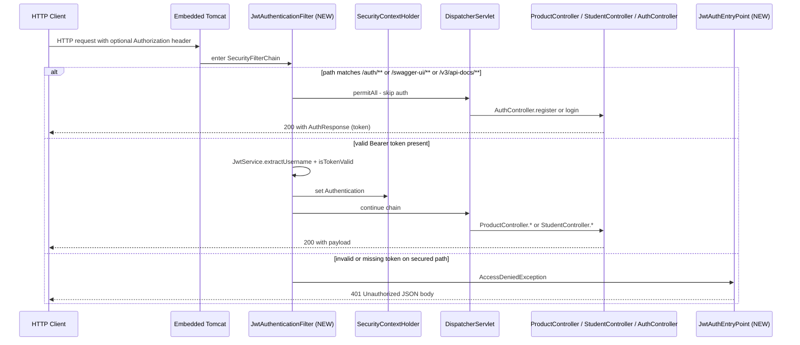

# Technical Specification

# 0. Agent Action Plan

## 0.1 Intent Clarification

### 0.1.1 Core Feature Objective

Based on the prompt, the Blitzy platform understands that the new feature requirement is to introduce a complete **stateless JWT (JSON Web Token) authentication and authorization layer** into the existing Spring Boot 3.4.4 Product CRUD application [`EP-Spring-Boot--main/pom.xml`:L7-L10] — adding Spring Security as the security filter framework, persisting user identities in the same MySQL schema that already hosts the `Product` entity [`EP-Spring-Boot--main/src/main/java/com/jspider/spring_boot_simple_crud_with_mysql/entity/Product.java`:L9-L24], exposing `POST /auth/register` and `POST /auth/login` as the only anonymously-reachable HTTP routes, and requiring a valid `Authorization: Bearer <jwt>` header for every other HTTP request handled by the application.

The following table preserves each requirement from the user prompt verbatim and pairs it with the precise technical clarification that the Blitzy platform will apply during implementation.

| # | User Requirement (Verbatim) | Technical Clarification |
|---|------------------------------|--------------------------|
| 1 | Add Spring Security | Add `org.springframework.boot:spring-boot-starter-security` as a direct Maven dependency (version inherited from the existing `spring-boot-starter-parent:3.4.4` BOM at [`pom.xml`:L5-L10]) and provide an `@EnableWebSecurity` `@Configuration` class that exposes a `SecurityFilterChain` bean |
| 2 | Create login and register APIs | Create an `AuthController` mapped at `/auth` with `@PostMapping("/register")` and `@PostMapping("/login")` endpoints accepting JSON bodies |
| 3 | Generate JWT token after successful login | After `AuthenticationManager.authenticate(...)` returns a successful `Authentication`, invoke a `JwtService.generateToken(...)` that signs the token with HS256 using a Base64-encoded secret externalised in `application.properties` |
| 4 | Secure all `/products` APIs | The existing product controller is mapped at `/product` (singular) per [`controller/ProductController.java`:L28]; the SecurityFilterChain will enforce `anyRequest().authenticated()` so the existing `/product/**` surface — together with any other non-`/auth` endpoint (including `/student/**` from [`controller/StudentController.java`:L12]) — requires a valid token |
| 5 | Allow public access only to `/auth/**` | `requestMatchers("/auth/**").permitAll()` in the SecurityFilterChain, with Swagger/OpenAPI documentation paths (`/v3/api-docs/**`, `/swagger-ui/**`, `/swagger-ui.html`) also permitted since springdoc-openapi is already wired at [`pom.xml`:L67-L72] and developer ergonomics for documentation discovery would otherwise be lost |
| 6 | Use `BCryptPasswordEncoder` for password encryption | Declare `@Bean PasswordEncoder passwordEncoder() { return new BCryptPasswordEncoder(); }` in the security configuration and inject it into the registration service for password hashing and into the `DaoAuthenticationProvider` for credential verification |
| 7 | Create User entity with id, username, password, role | Create a JPA `@Entity` named `User` (mapped to table `users` to avoid the reserved-word collision in some databases) with the four fields `id` (Integer, `@Id @GeneratedValue`), `username` (String, `@Column(unique=true, nullable=false)`), `password` (String, stores the BCrypt hash), and `role` (String) |
| 8 | Add JWT validation filter | Create `JwtAuthenticationFilter extends OncePerRequestFilter` that reads the `Authorization` header, strips the `Bearer ` prefix, validates the token via `JwtService`, loads the user via a custom `UserDetailsService`, and populates `SecurityContextHolder` with a `UsernamePasswordAuthenticationToken` |
| 9 | Return 401 Unauthorized for invalid or missing token | Implement `AuthenticationEntryPoint` (`JwtAuthEntryPoint`) that writes a JSON body with HTTP status 401 and wire it via `http.exceptionHandling(eh -> eh.authenticationEntryPoint(...))` |

#### 0.1.1.1 Implicit Requirements Surfaced

The following requirements are not stated explicitly in the prompt but are **necessary for the feature to compile, build, and behave as the user has described**. They are surfaced here so the implementation agent does not overlook them.

- A `UserRepository extends JpaRepository<User, Integer>` is required to persist and look up users (`findByUsername`, `existsByUsername`); without it the `CustomUserDetailsService` and registration flow cannot function.
- A `UserDetailsService` implementation (`CustomUserDetailsService`) is required by Spring Security's `DaoAuthenticationProvider` SPI to translate the JPA `User` entity into a `UserDetails` instance carrying granted authorities.
- Request and response DTOs (`LoginRequest`, `RegisterRequest`, `AuthResponse`) are required to avoid binding the raw JPA `User` entity at the controller boundary (mass-assignment prevention) and to give `/auth/login` a clean shape for returning `{ token, username, role }`.
- The JWT signing secret and expiration window must be externalised to `application.properties` (`jwt.secret`, `jwt.expiration-ms`) so different environments can rotate or extend tokens without code changes.
- The Spring Security 6.x `AuthenticationManager` is no longer auto-exposed as a bean and must be declared explicitly via `AuthenticationConfiguration.getAuthenticationManager()`; otherwise `AuthService.login()` cannot trigger credential verification.
- The session creation policy must be `STATELESS` because JWT (rather than `HttpSession`) is now the source of identity; CSRF must be disabled for the same reason (no session cookies are issued).
- The `jjwt` library family (`jjwt-api`, `jjwt-impl`, `jjwt-jackson`) at version **0.13.0** must be added because Spring Security itself does not ship JWT signing/parsing primitives — version 0.13.0 is verified as the current stable line compatible with non-Android JDK projects on Spring Boot 3.x.
- The Hibernate `ddl-auto=update` setting at [`application.properties`:L9] will auto-create the new `users` table from the `User` `@Entity` on the next application startup; no Flyway or Liquibase migration script is needed because the codebase has no existing migration infrastructure (as confirmed by the absence of `db/migration/` or `liquibase/` directories anywhere in the repository).

### 0.1.2 Special Instructions and Constraints

The prompt embeds three rule directives and three constraint directives that the implementation must honour. They are preserved here verbatim with the technical interpretation that will govern code generation.

#### 0.1.2.1 User-Specified Rules (preserved verbatim)

- **Use camelCase naming convention** — applied to all identifiers (fields, methods, parameters, local variables) in every new Java class. This is the Java idiomatic default; the rule is explicitly restated here so it is preserved through code generation.
- **Add comment `// Rule Applied` in every modified or new class** — applied as a class-level Java comment at the top of every `CREATE` and `MODIFY` Java file. For non-Java files in the `MODIFY` list, the file-type-appropriate equivalent will be used: `<!-- Rule Applied -->` in `pom.xml` and `# Rule Applied` in `application.properties`.
- **Add at least one log or `System.out.println` in each new method** — applied as one logging statement (either `System.out.println(...)` to remain consistent with the existing project style at [`SpringBootSimpleCrudWithMysqlApplication.java`:L28] and [`ProductController.java`:L56,L78], or an SLF4J logger call) in **every** method body of **every** new Java class. Abstract / interface methods declared without a body in `UserRepository` are not affected because the rule only applies to methods that have a body to log from.

#### 0.1.2.2 User-Specified Constraints

- **Do not break existing CRUD APIs** — interpreted as: zero source-code changes to `ProductController.java`, `ProductDao.java`, `ProductRepository.java`, `Product.java`, `ResponseStructure.java`, or `StudentController.java`. The existing endpoint paths (`/product/**`, `/student/**`) are preserved exactly; authentication coverage is applied entirely at the SecurityFilterChain level so existing routes continue to resolve correctly for callers that present a valid JWT.
- **Keep code clean and modular** — interpreted as: separate the new functionality into purpose-aligned packages (`dto/`, `service/`, `filter/`, `config/`) alongside extending the existing `entity/`, `repository/`, `controller/` packages. No "kitchen sink" classes; each new class has a single responsibility.
- **Ensure application builds successfully** — interpreted as: use the stable, version-pinned `jjwt 0.13.0` family, rely on the existing `spring-boot-starter-parent:3.4.4` BOM for Spring Security version management to avoid transitive conflicts, and keep `spring.jpa.hibernate.ddl-auto=update` so the new `users` table is auto-created on startup without manual schema migration.

#### 0.1.2.3 Path Naming Discrepancy and Resolution

The prompt instructs the platform to "Secure all `/products` APIs" (plural). The actual REST mapping in the codebase, however, is the singular `/product`:

- `@RequestMapping(value = "/product")` at [`controller/ProductController.java`:L28]
- The project's own [`README.md`:L90-L96] documents the surface as `/products` (plural)

**Resolution**: The path discrepancy between the README and the actual `@RequestMapping` annotation is treated as a pre-existing documentation issue, not a directive to rename existing routes. Renaming `/product` to `/products` would change the public contract of every existing CRUD endpoint and would directly violate the user's "Do not break existing CRUD APIs" constraint. Therefore the implementation will leave the controller's `@RequestMapping` unchanged and apply authentication to all paths that are not under `/auth/**`. This single security rule covers both the existing `/product/**` surface (the spirit of the user's requirement) and the orphan `/student/**` surface (which would otherwise become an authentication gap) without any controller code modification.

### 0.1.3 Technical Interpretation

These feature requirements translate to the following technical implementation strategy: introduce a **dedicated security stack** that intercepts every inbound HTTP request before it reaches `DispatcherServlet`, evaluates the presence and validity of a JWT, attaches an authenticated principal to the request when the token is valid, and rejects the request with HTTP 401 when it is not — with the sole exception of the `/auth/**` route group, which the SecurityFilterChain permits unconditionally so users can register and obtain a token.

The strategy decomposes into seven coordinated technical actions:

- **To add Spring Security**, modify the build descriptor to pull in `spring-boot-starter-security` and create `config/SecurityConfig.java` exposing a `SecurityFilterChain` bean, a `PasswordEncoder` bean returning `BCryptPasswordEncoder`, an `AuthenticationManager` bean derived from `AuthenticationConfiguration`, and a `DaoAuthenticationProvider` bean that ties `CustomUserDetailsService` to the password encoder.
- **To create the login and register APIs**, create `controller/AuthController.java` at `/auth` with two `@PostMapping` methods (`/register`, `/login`) accepting `RegisterRequest` and `LoginRequest` DTOs and returning `AuthResponse` (containing `token`, `username`, `role`, and `type="Bearer"`).
- **To generate the JWT after successful login**, create `service/JwtService.java` using the `jjwt 0.13.0` API to build a compact JWS signed with HS256, embedding `subject=username` and a custom `role` claim, with expiration derived from the externalised `jwt.expiration-ms` property.
- **To secure all `/product/**` endpoints (and every other non-`/auth` endpoint)**, configure `http.authorizeHttpRequests(auth -> auth.requestMatchers("/auth/**", "/v3/api-docs/**", "/swagger-ui/**", "/swagger-ui.html").permitAll().anyRequest().authenticated())` inside the SecurityFilterChain.
- **To use `BCryptPasswordEncoder`**, declare it once as a `@Bean` in `SecurityConfig` and inject it into both `AuthService` (for `passwordEncoder.encode(...)` during register) and the `DaoAuthenticationProvider` (for transparent password verification during login).
- **To create the User entity**, add `entity/User.java` mirroring the existing entity conventions seen in [`entity/Product.java`:L9-L24] (`@Entity`, `@Id`, Lombok `@Data`) and add `repository/UserRepository.java` mirroring [`repository/ProductRepository.java`:L13] (`extends JpaRepository<User, Integer>`).
- **To add the JWT validation filter and 401 handler**, create `filter/JwtAuthenticationFilter.java` (extends `OncePerRequestFilter`, registered via `http.addFilterBefore(jwtFilter, UsernamePasswordAuthenticationFilter.class)`) and `config/JwtAuthEntryPoint.java` (implements `AuthenticationEntryPoint`, wired via `http.exceptionHandling(...)`).

The strategy preserves the existing layered architecture documented in [`README.md`:§Project Structure Overview] (controller → DAO → repository → entity) by adding parallel layers for the authentication concern (controller → service → repository → entity) rather than threading security concerns through the existing product layer.

## 0.2 Repository Scope Discovery

### 0.2.1 Comprehensive File Analysis

The repository was systematically inspected from the root `EP-Spring-Boot--main/` down through `src/main/java`, `src/main/resources`, and `src/test/java`. The current production source tree consists of **eight Java source files plus one configuration file** under the application package `com.jspider.spring_boot_simple_crud_with_mysql`. None of these files require source-code modification for the JWT feature; security coverage is applied entirely at the SecurityFilterChain level so that the user's "Do not break existing CRUD APIs" constraint is honoured.

#### 0.2.1.1 Existing Files Cataloged

| Path (absolute) | Role | Relevance to JWT Feature |
|---|---|---|
| `EP-Spring-Boot--main/pom.xml` | Maven build descriptor [`pom.xml`:L1-L102] | **MODIFY** — add 4 new `<dependency>` blocks |
| `EP-Spring-Boot--main/src/main/resources/application.properties` | Runtime configuration [`application.properties`:L1-L10] | **MODIFY** — add `jwt.secret` and `jwt.expiration-ms` |
| `EP-Spring-Boot--main/src/main/java/com/jspider/spring_boot_simple_crud_with_mysql/SpringBootSimpleCrudWithMysqlApplication.java` | Bootstrap class with `@SpringBootApplication` [`SpringBootSimpleCrudWithMysqlApplication.java`:L10,L23] | **REFERENCE** — package root for `@ComponentScan`; no code change |
| `.../controller/ProductController.java` | REST controller at `/product` [`controller/ProductController.java`:L28] | **REFERENCE** — becomes authenticated via SecurityFilterChain; no code change |
| `.../controller/StudentController.java` | REST controller at `/student` [`controller/StudentController.java`:L12] | **REFERENCE** — becomes authenticated via same SecurityFilterChain; no code change |
| `.../dao/ProductDao.java` | DAO orchestrator `@Repository` [`dao/ProductDao.java`:L17] | **REFERENCE** — no code change |
| `.../entity/Product.java` | JPA `@Entity` [`entity/Product.java`:L9-L24] | **REFERENCE** — pattern reference for new `User` entity (Lombok `@Data`, `jakarta.persistence.*`) |
| `.../repository/ProductRepository.java` | `JpaRepository<Product, Integer>` [`repository/ProductRepository.java`:L13] | **REFERENCE** — pattern reference for new `UserRepository` |
| `.../responses/ResponseStructure.java` | Generic response envelope [`responses/ResponseStructure.java`:L11-L16] | **REFERENCE** — existing pattern; auth DTOs intentionally use their own typed shapes |
| `EP-Spring-Boot--main/src/test/java/.../SpringBootSimpleCrudWithMysqlApplicationTests.java` | `@SpringBootTest` smoke test [`tests:L6-L12`] | **REFERENCE** — `contextLoads()` continues to pass after security is added |

#### 0.2.1.2 Integration Point Discovery

The discovery confirms that the existing application is **a clean integration target** — the JWT feature attaches at five well-defined integration points without disturbing any existing source code:

- **`@ComponentScan` integration**: `SpringBootSimpleCrudWithMysqlApplication.java` is positioned at the root of `com.jspider.spring_boot_simple_crud_with_mysql` [`SpringBootSimpleCrudWithMysqlApplication.java`:L1] so the implicit `@ComponentScan` automatically discovers all new beans (`@RestController`, `@Service`, `@Configuration`, `@Component`) created in sub-packages `config/`, `controller/`, `dto/`, `entity/`, `filter/`, `repository/`, `service/`. No change to the bootstrap class is required.
- **Spring Security auto-configuration integration**: Once `spring-boot-starter-security` is on the classpath, Spring Boot's `SecurityAutoConfiguration` engages and looks for a user-provided `SecurityFilterChain` bean. The new `config/SecurityConfig.java` provides exactly that.
- **JPA `@EntityScan` integration**: Spring Data JPA auto-scans `@Entity` classes under the application package; the new `entity/User.java` will be picked up automatically without any `@EntityScan` adjustment.
- **Hibernate `ddl-auto=update` integration** [`application.properties`:L9]: On next startup, Hibernate will detect the new `User` entity and issue `CREATE TABLE users (...)` against the MySQL schema `spring-m12`. No Flyway/Liquibase script is needed because no migration tooling is present in the codebase.
- **springdoc-openapi auto-documentation integration** [`pom.xml`:L67-L72]: The existing springdoc-openapi 2.8.6 will discover the new `AuthController` endpoints (`POST /auth/register`, `POST /auth/login`) and expose them in the Swagger UI under the same `/swagger-ui.html` surface that documents the existing product API.

#### 0.2.1.3 Database Models and Migrations Affected

- **New schema object**: a `users` table will be created by Hibernate on next startup from the `User` `@Entity`. Columns: `id` (auto-increment PK), `username` (unique), `password` (BCrypt hash), `role`.
- **No changes** to the existing `product` table — `Product` entity at [`entity/Product.java`:L9-L24] is unchanged.
- **No migration files**: the codebase has no existing migration directory (`db/migration/`, `liquibase/`, etc., are absent); the established convention is Hibernate `ddl-auto=update`.

#### 0.2.1.4 Service and Controller Touchpoints

- **No existing service classes are modified**. The DAO layer (`ProductDao`) operates exclusively on `Product`; the new `AuthService` operates on `User` and is independent.
- **No existing controllers are modified**. `ProductController` and `StudentController` remain byte-for-byte identical; their endpoints simply become authenticated by virtue of the new SecurityFilterChain.
- **No middleware/interceptor changes** to existing code. The new `JwtAuthenticationFilter` is added via `http.addFilterBefore(...)` in the new `SecurityConfig`; no existing filter is touched (none exists today, as confirmed in Section 6.4.2 of the existing tech spec).

### 0.2.2 Web Search Research Conducted

The following targeted research was performed to confirm version pins and integration patterns for Spring Boot 3.4.4 + Java 17 + Spring Security 6.x + JWT.

| Research Area | Query Theme | Finding Applied |
|---|---|---|
| Best practices for JWT in Spring Boot 3 | "jjwt Spring Boot 3 Maven dependency latest" | Verified current stable line is `jjwt 0.13.0` per the official `jwtk/jjwt` GitHub README; all three modules (`jjwt-api`, `jjwt-impl`, `jjwt-jackson`) at the same version |
| Library recommendation for JWT signing | Maven Central availability of `io.jsonwebtoken:jjwt-*` | Confirmed `0.13.0` artifacts are published to Maven Central and used by 961+ components — no custom repository configuration required |
| Common pattern for Spring Security 6 + JWT | Project samples on Spring Boot 3.x with `SecurityFilterChain` | Adopted the standard pattern: `SecurityFilterChain` bean + `OncePerRequestFilter` + `AuthenticationEntryPoint` + stateless session policy + CSRF disabled |
| Security consideration for stateless API | Session management with JWT-based auth | Confirmed `SessionCreationPolicy.STATELESS` is required (no `HttpSession`, no session-fixation surface, no CSRF token because no session cookie) |
| Spring Boot 3.x `AuthenticationManager` exposure | `AuthenticationManager` no longer auto-bean in Spring Security 6 | Confirmed it must be explicitly exposed via `AuthenticationConfiguration.getAuthenticationManager()` |

### 0.2.3 New File Requirements

The feature requires **twelve new Java source files** distributed across seven packages, plus two configuration-file modifications. The package structure intentionally mirrors the existing convention (one purpose per package).

#### 0.2.3.1 New Source Files

| New File (absolute path) | Specific Purpose |
|---|---|
| `EP-Spring-Boot--main/src/main/java/com/jspider/spring_boot_simple_crud_with_mysql/entity/User.java` | JPA entity for user identity; columns `id`, `username` (unique), `password` (BCrypt hash), `role` |
| `EP-Spring-Boot--main/src/main/java/com/jspider/spring_boot_simple_crud_with_mysql/repository/UserRepository.java` | `JpaRepository<User, Integer>` with `Optional<User> findByUsername(String)` and `boolean existsByUsername(String)` |
| `EP-Spring-Boot--main/src/main/java/com/jspider/spring_boot_simple_crud_with_mysql/dto/RegisterRequest.java` | Inbound payload for `POST /auth/register`: `username`, `password`, `role` |
| `EP-Spring-Boot--main/src/main/java/com/jspider/spring_boot_simple_crud_with_mysql/dto/LoginRequest.java` | Inbound payload for `POST /auth/login`: `username`, `password` |
| `EP-Spring-Boot--main/src/main/java/com/jspider/spring_boot_simple_crud_with_mysql/dto/AuthResponse.java` | Outbound payload: `token`, `username`, `role`, `type` (defaults to `"Bearer"`) |
| `EP-Spring-Boot--main/src/main/java/com/jspider/spring_boot_simple_crud_with_mysql/service/JwtService.java` | JWT signing, parsing, validation using jjwt 0.13.0; reads `jwt.secret` and `jwt.expiration-ms` |
| `EP-Spring-Boot--main/src/main/java/com/jspider/spring_boot_simple_crud_with_mysql/service/CustomUserDetailsService.java` | `UserDetailsService` SPI implementation that loads `User` from `UserRepository` and returns `UserDetails` with authority `ROLE_{role}` |
| `EP-Spring-Boot--main/src/main/java/com/jspider/spring_boot_simple_crud_with_mysql/service/AuthService.java` | Business logic for `register` (uniqueness check + BCrypt hash + save) and `login` (delegate to `AuthenticationManager` + issue JWT) |
| `EP-Spring-Boot--main/src/main/java/com/jspider/spring_boot_simple_crud_with_mysql/controller/AuthController.java` | `@RestController @RequestMapping("/auth")` exposing `POST /register` and `POST /login` |
| `EP-Spring-Boot--main/src/main/java/com/jspider/spring_boot_simple_crud_with_mysql/filter/JwtAuthenticationFilter.java` | `OncePerRequestFilter` that extracts the `Bearer` token, validates it, and populates `SecurityContextHolder` |
| `EP-Spring-Boot--main/src/main/java/com/jspider/spring_boot_simple_crud_with_mysql/config/SecurityConfig.java` | `@Configuration @EnableWebSecurity` exposing `SecurityFilterChain`, `PasswordEncoder` (BCrypt), `AuthenticationManager`, `DaoAuthenticationProvider` |
| `EP-Spring-Boot--main/src/main/java/com/jspider/spring_boot_simple_crud_with_mysql/config/JwtAuthEntryPoint.java` | `AuthenticationEntryPoint` implementation that writes HTTP 401 with a JSON error body |

#### 0.2.3.2 New Test Files

None. The user prompt does not request unit or integration test additions. The existing `@SpringBootTest` smoke test [`tests:L6-L12`] continues to pass because Spring Security configured by `SecurityConfig` does not block application-context startup.

#### 0.2.3.3 New Configuration

No new standalone configuration files (e.g., `application-security.yaml`) are introduced. The two new properties (`jwt.secret`, `jwt.expiration-ms`) are appended to the existing `application.properties` to maintain the project's single-file configuration convention [`application.properties`:L1-L10].

## 0.3 Dependency Inventory

The JWT authentication feature requires **four new Maven dependencies**. No existing dependency is removed, upgraded, or downgraded — the project remains anchored to `spring-boot-starter-parent:3.4.4` [`pom.xml`:L5-L10] and the existing eight dependencies [`pom.xml`:L32-L73] are preserved verbatim.

### 0.3.1 New Public Package Additions

The following table lists the exact Maven coordinates that will be inserted into the `<dependencies>` block of [`EP-Spring-Boot--main/pom.xml`].

| Registry | Group / Artifact | Version | Scope | Purpose |
|---|---|---|---|---|
| Maven Central | `org.springframework.boot:spring-boot-starter-security` | Managed by parent BOM 3.4.4 (resolves to Spring Security 6.4.x) | compile | Brings Spring Security 6.x, BCrypt, `SecurityFilterChain` DSL, `AuthenticationManager`, `UserDetailsService` SPI |
| Maven Central | `io.jsonwebtoken:jjwt-api` | **0.13.0** | compile | Public JWT API surface: `Jwts.builder()`, `Jwts.parser()`, `Claims`, `Decoders`, `Keys` |
| Maven Central | `io.jsonwebtoken:jjwt-impl` | **0.13.0** | runtime | Runtime implementation of the `jjwt-api` SPI |
| Maven Central | `io.jsonwebtoken:jjwt-jackson` | **0.13.0** | runtime | Jackson-based JSON serialization for JWT payloads (Jackson is already on the classpath via `spring-boot-starter-web`) |

**Version sourcing**:
- `spring-boot-starter-security` carries no explicit `<version>` tag because the parent POM already manages it; this matches the convention used by every other Spring Boot starter currently in [`pom.xml`].
- `jjwt 0.13.0` is the current stable line for non-Android JDK projects per the official `jwtk/jjwt` project; the version is explicitly pinned because Spring Boot does not manage `io.jsonwebtoken` artifacts in its BOM.

### 0.3.2 Configuration Additions

Two new properties will be appended to `EP-Spring-Boot--main/src/main/resources/application.properties`:

| Property | Type | Default | Read By |
|---|---|---|---|
| `jwt.secret` | Base64-encoded 256-bit key | Placeholder requiring environment-specific override before deployment | `JwtService` via `@Value("${jwt.secret}")` |
| `jwt.expiration-ms` | long (milliseconds) | `3600000` (1 hour) | `JwtService` via `@Value("${jwt.expiration-ms}")` |

The existing ten configuration lines [`application.properties`:L1-L10] remain unchanged, including the `spring.jpa.hibernate.ddl-auto=update` setting which is required for the new `users` table to be auto-created by Hibernate on next startup.

### 0.3.3 Dependency Updates and Imports

#### 0.3.3.1 Files Requiring Import Updates

No existing Java file requires import updates. The new dependencies are consumed exclusively by the **new** files listed in Section 0.5; no existing imports are renamed, removed, or transformed.

#### 0.3.3.2 New Imports Introduced (by package)

The new dependencies introduce the following package roots into the codebase. They appear only in the new files.

| New Import Root | Used In |
|---|---|
| `org.springframework.security.*` | `SecurityConfig`, `CustomUserDetailsService`, `JwtAuthenticationFilter`, `AuthService`, `JwtAuthEntryPoint` |
| `org.springframework.security.crypto.bcrypt.BCryptPasswordEncoder` | `SecurityConfig` |
| `org.springframework.security.crypto.password.PasswordEncoder` | `SecurityConfig`, `AuthService` |
| `org.springframework.security.core.userdetails.UserDetails`, `UserDetailsService` | `CustomUserDetailsService`, `JwtAuthenticationFilter`, `JwtService` |
| `org.springframework.security.config.annotation.web.builders.HttpSecurity` | `SecurityConfig` |
| `org.springframework.security.web.SecurityFilterChain`, `AuthenticationEntryPoint` | `SecurityConfig`, `JwtAuthEntryPoint` |
| `org.springframework.security.web.authentication.UsernamePasswordAuthenticationFilter` | `SecurityConfig` |
| `org.springframework.web.filter.OncePerRequestFilter` | `JwtAuthenticationFilter` |
| `io.jsonwebtoken.Jwts`, `Claims`, `JwtParser` | `JwtService` |
| `io.jsonwebtoken.io.Decoders` | `JwtService` |
| `io.jsonwebtoken.security.Keys`, `javax.crypto.SecretKey` | `JwtService` |

#### 0.3.3.3 External Reference Updates

- **Configuration files**: only `application.properties` is touched (Section 0.3.2). No new YAML, no environment-specific profile file is introduced.
- **Documentation files**: `README.md` is intentionally **not** modified — the user did not request documentation updates and the existing README's `/products` references already drift from the actual `/product` mapping (pre-existing issue, see Section 0.1.2.3).
- **Build files**: only `pom.xml` is modified (Section 0.3.1). The Maven wrapper scripts (`mvnw`, `mvnw.cmd`) and the duplicate `EP-Spring-Boot--main/bin/pom.xml` (an Eclipse IDE staging artifact) are not modified.
- **CI/CD files**: none present in the repository (verified via `find` across the project); no changes needed.

## 0.4 Integration Analysis

This section enumerates every touchpoint between the new JWT feature and the existing application surface. A central finding from the scope analysis is that **the integration is purely additive**: no existing Java source file requires code modification, because Spring's auto-configuration, component scanning, JPA `@EntityScan`, and Hibernate `ddl-auto=update` together pick up the new components transparently.

### 0.4.1 Existing Code Touchpoints

#### 0.4.1.1 Direct Modifications Required

The only existing files that require any modification are configuration files — no `.java` source file is edited.

| File | Modification | Reason |
|---|---|---|
| `EP-Spring-Boot--main/pom.xml` | Insert 4 `<dependency>` blocks inside the existing `<dependencies>` element [`pom.xml`:L32-L73] | Bring Spring Security 6.x and jjwt 0.13.0 onto the classpath |
| `EP-Spring-Boot--main/src/main/resources/application.properties` | Append `jwt.secret` and `jwt.expiration-ms` after the existing `spring.jpa.show-sql=true` line at [`application.properties`:L10] | Externalise the JWT signing key and token lifetime so `JwtService` can read them via `@Value(...)` |

#### 0.4.1.2 Why No Existing `.java` File Needs Editing

| Existing File | Why It Is Untouched |
|---|---|
| `SpringBootSimpleCrudWithMysqlApplication.java` [main, `package` declared at line 1] | Already at the root of `com.jspider.spring_boot_simple_crud_with_mysql`; the implicit `@ComponentScan` from `@SpringBootApplication` [`SpringBootSimpleCrudWithMysqlApplication.java`:L10] discovers every new `@RestController`, `@Service`, `@Repository`, `@Configuration`, and `@Component` in `controller/`, `service/`, `repository/`, `config/`, `filter/` |
| `ProductController.java` [`controller/ProductController.java`:L28] | Mapped at `/product`; becomes authenticated because the new `SecurityFilterChain` declares `anyRequest().authenticated()`. No `@PreAuthorize`, no per-method annotation, no path change |
| `StudentController.java` [`controller/StudentController.java`:L12] | Same as above — secured implicitly by the filter chain |
| `ProductDao.java` [`dao/ProductDao.java`] | Domain DAO; unrelated to authentication |
| `Product.java` [`entity/Product.java`] | Domain entity; unrelated to authentication |
| `ProductRepository.java` [`repository/ProductRepository.java`] | Domain repository; positional `?` parameters at [`repository/ProductRepository.java`:L17,L20] preserve the SQL-injection-mitigated query style noted in §6.4.6.3 of the existing security tech spec |
| `ResponseStructure.java` [`responses/ResponseStructure.java`] | Generic envelope used by `ProductController`; the new auth flow uses its own dedicated `AuthResponse` DTO and does not depend on this class |
| `SpringBootSimpleCrudWithMysqlApplicationTests.java` [`tests:L6-L12`] | `@SpringBootTest contextLoads()` smoke test; Spring Security configured as designed does not prevent context startup, so the test continues to pass without modification |

### 0.4.2 Dependency Injection Wiring

The new feature introduces a fresh, self-contained dependency injection graph. No existing bean is re-wired.

```mermaid
graph LR
    AC["AuthController<br/>@RestController"] -->|@Autowired| AS["AuthService<br/>@Service"]
    AS -->|@Autowired| UR["UserRepository<br/>JpaRepository"]
    AS -->|@Autowired| PE["PasswordEncoder<br/>BCrypt @Bean"]
    AS -->|@Autowired| AM["AuthenticationManager<br/>@Bean"]
    AS -->|@Autowired| JS["JwtService<br/>@Service"]
    AM -->|delegates to| DAP["DaoAuthenticationProvider<br/>@Bean"]
    DAP -->|@Autowired| CUDS["CustomUserDetailsService<br/>@Service"]
    DAP -->|injected| PE
    CUDS -->|@Autowired| UR
    JF["JwtAuthenticationFilter<br/>@Component"] -->|@Autowired| JS
    JF -->|@Autowired| CUDS
    SC["SecurityConfig<br/>@Configuration"] -->|registers| JF
    SC -->|wires| JEP["JwtAuthEntryPoint<br/>@Component"]
    SC -->|provides bean| PE
    SC -->|provides bean| AM
    SC -->|provides bean| DAP
```

No existing bean (`ProductDao`, `ProductRepository`, `ResponseStructure`) participates in this graph; the two graphs are disjoint at the bean level and intersect only at the `SecurityFilterChain` which sits in front of all controllers.

### 0.4.3 Database and Schema Updates

| Change | Mechanism | When It Takes Effect |
|---|---|---|
| Create `users` table | Hibernate `ddl-auto=update` [`application.properties`:L9] generates `CREATE TABLE users (...)` from the new `User` `@Entity` | First application startup after the feature is deployed |
| Add unique index on `username` | Derived from `@Column(unique = true)` on the `username` field of `User.java` | Same startup event |
| No changes to `product` table | The `Product` entity at [`entity/Product.java`:L9-L24] is unchanged | N/A |
| No migration scripts added | The codebase has no existing migration directory (no Flyway, no Liquibase); the established convention is Hibernate auto-DDL | N/A |

#### 0.4.3.1 Operational Note on `ddl-auto=update`

Hibernate `ddl-auto=update` adds missing tables and columns but never drops or alters existing schema objects in destructive ways. This guarantees that the existing `product` table and any production data are preserved. Operators who prefer explicit migrations may convert this approach to Flyway/Liquibase in a future change, but doing so is **out of scope** of the current JWT feature.

### 0.4.4 HTTP Request Lifecycle Integration

The diagram below shows how every inbound HTTP request flows after the JWT feature is in place — the new components are highlighted; existing components are unchanged.



The lifecycle preserves the existing `DispatcherServlet → @RestController → @Repository → JPA → MySQL` path documented in §4 of the existing tech spec; the only addition is the SecurityFilterChain in front of `DispatcherServlet`.

## 0.5 Technical Implementation

### 0.5.1 File-by-File Execution Plan

**CRITICAL**: Every file listed here MUST be created or modified exactly as specified. Files are organised into five logical groups so the implementation can proceed bottom-up (data layer → DTOs → services → web layer → security configuration), guaranteeing that downstream dependencies always resolve.

#### 0.5.1.1 Group A — Data Layer (User Identity Persistence)

- **CREATE** `EP-Spring-Boot--main/src/main/java/com/jspider/spring_boot_simple_crud_with_mysql/entity/User.java`
    - JPA `@Entity` mapped to table `users`; fields `Integer id` (`@Id @GeneratedValue(strategy = GenerationType.IDENTITY)`), `String username` (`@Column(unique = true, nullable = false)`), `String password` (`@Column(nullable = false)` storing BCrypt hash), `String role` (`@Column(nullable = false)`)
    - Annotations: `@Entity`, `@Table(name = "users")`, Lombok `@Data`, `@NoArgsConstructor`, `@AllArgsConstructor` — mirroring the pattern used by `Product.java` at [`entity/Product.java`:L9-L11]
    - Includes the `// Rule Applied` class-level comment per user rule
- **CREATE** `EP-Spring-Boot--main/src/main/java/com/jspider/spring_boot_simple_crud_with_mysql/repository/UserRepository.java`
    - `public interface UserRepository extends JpaRepository<User, Integer>` — mirroring `ProductRepository` at [`repository/ProductRepository.java`:L13]
    - Methods: `Optional<User> findByUsername(String username)` and `boolean existsByUsername(String username)` (derived query methods; Spring Data JPA generates implementations)
    - Includes the `// Rule Applied` interface-level comment

#### 0.5.1.2 Group B — DTO Layer (Request and Response Boundary)

- **CREATE** `EP-Spring-Boot--main/src/main/java/com/jspider/spring_boot_simple_crud_with_mysql/dto/RegisterRequest.java`
    - Plain DTO; fields `String username`, `String password`, `String role`
    - Lombok `@Data`, `@NoArgsConstructor`, `@AllArgsConstructor`
    - `// Rule Applied` class comment
- **CREATE** `EP-Spring-Boot--main/src/main/java/com/jspider/spring_boot_simple_crud_with_mysql/dto/LoginRequest.java`
    - Plain DTO; fields `String username`, `String password`
    - Lombok `@Data`, `@NoArgsConstructor`, `@AllArgsConstructor`
    - `// Rule Applied` class comment
- **CREATE** `EP-Spring-Boot--main/src/main/java/com/jspider/spring_boot_simple_crud_with_mysql/dto/AuthResponse.java`
    - Outbound DTO returned by `/auth/login` (and optionally by `/auth/register`); fields `String token`, `String username`, `String role`, `String type` (default `"Bearer"`)
    - Lombok `@Data`, `@NoArgsConstructor`, `@AllArgsConstructor`
    - `// Rule Applied` class comment

#### 0.5.1.3 Group C — Service Layer (Business Logic and Security SPIs)

- **CREATE** `EP-Spring-Boot--main/src/main/java/com/jspider/spring_boot_simple_crud_with_mysql/service/JwtService.java`
    - `@Service`-annotated class encapsulating JWT signing, parsing, and validation against the jjwt 0.13.0 API
    - Configuration injection via `@Value("${jwt.secret}")` and `@Value("${jwt.expiration-ms}")`
    - Key methods (each contains a `System.out.println` or SLF4J log per user rule):

```java
public String generateToken(UserDetails userDetails) { /* Jwts.builder()...signWith(key).compact() */ }
public String extractUsername(String token) { /* Jwts.parser().verifyWith(key)... */ }
public boolean isTokenValid(String token, UserDetails userDetails) { /* equals + !isExpired */ }
```

    - Private helper `SecretKey getSigningKey()` calling `Keys.hmacShaKeyFor(Decoders.BASE64.decode(secret))`
    - `// Rule Applied` class comment

- **CREATE** `EP-Spring-Boot--main/src/main/java/com/jspider/spring_boot_simple_crud_with_mysql/service/CustomUserDetailsService.java`
    - `@Service` implementing `org.springframework.security.core.userdetails.UserDetailsService`
    - Method: `UserDetails loadUserByUsername(String username) throws UsernameNotFoundException` — calls `userRepository.findByUsername(username)`, throws `UsernameNotFoundException` if absent, otherwise builds `org.springframework.security.core.userdetails.User` with `SimpleGrantedAuthority("ROLE_" + user.getRole())`
    - Dependencies: `@Autowired UserRepository`
    - Includes a `System.out.println` log per user rule
    - `// Rule Applied` class comment

- **CREATE** `EP-Spring-Boot--main/src/main/java/com/jspider/spring_boot_simple_crud_with_mysql/service/AuthService.java`
    - `@Service` orchestrating the `/auth/register` and `/auth/login` use cases
    - Method `AuthResponse register(RegisterRequest request)`:
        - Calls `userRepository.existsByUsername(username)` to enforce uniqueness; throws an exception (or returns 400) if the user already exists
        - Calls `passwordEncoder.encode(request.getPassword())` to BCrypt-hash the password (per user requirement 6)
        - Persists the new `User`
        - Returns an `AuthResponse` (token may be null on register-only response, or freshly minted if desired)
    - Method `AuthResponse login(LoginRequest request)`:
        - Calls `authenticationManager.authenticate(new UsernamePasswordAuthenticationToken(username, password))` — internally consults `CustomUserDetailsService` and `BCryptPasswordEncoder`
        - On success calls `jwtService.generateToken(userDetails)` and returns `new AuthResponse(token, username, role, "Bearer")`
    - Dependencies: `UserRepository`, `PasswordEncoder`, `AuthenticationManager`, `JwtService`
    - Includes a `System.out.println` log in every method
    - `// Rule Applied` class comment

#### 0.5.1.4 Group D — Web Layer (Controller and Filter)

- **CREATE** `EP-Spring-Boot--main/src/main/java/com/jspider/spring_boot_simple_crud_with_mysql/controller/AuthController.java`
    - `@RestController @RequestMapping("/auth")`
    - Endpoints:
        - `@PostMapping("/register") public ResponseEntity<AuthResponse> register(@RequestBody RegisterRequest request)` — delegates to `authService.register(...)`
        - `@PostMapping("/login") public ResponseEntity<AuthResponse> login(@RequestBody LoginRequest request)` — delegates to `authService.login(...)`
    - Dependencies: `@Autowired AuthService`
    - Includes a `System.out.println` log in every method (preserving the existing project style at [`controller/ProductController.java`:L56,L78])
    - `// Rule Applied` class comment

- **CREATE** `EP-Spring-Boot--main/src/main/java/com/jspider/spring_boot_simple_crud_with_mysql/filter/JwtAuthenticationFilter.java`
    - `@Component` extending `org.springframework.web.filter.OncePerRequestFilter`
    - Method `protected void doFilterInternal(HttpServletRequest request, HttpServletResponse response, FilterChain chain)`:
        - Read `Authorization` header; if missing or not prefixed with `"Bearer "`, delegate to `chain.doFilter(...)` (let the entry point handle 401 downstream if needed)
        - Strip the `"Bearer "` prefix; call `jwtService.extractUsername(token)`
        - If `SecurityContextHolder.getContext().getAuthentication() == null` and username is non-null, load `UserDetails` via `customUserDetailsService.loadUserByUsername(username)`, validate via `jwtService.isTokenValid(token, userDetails)`, and on success create a `UsernamePasswordAuthenticationToken(userDetails, null, userDetails.getAuthorities())` with web details and set it on `SecurityContextHolder`
        - Always call `chain.doFilter(...)` at the end
    - Dependencies: `JwtService`, `CustomUserDetailsService`
    - Includes a `System.out.println` log
    - `// Rule Applied` class comment

#### 0.5.1.5 Group E — Configuration Layer (Spring Security Wiring)

- **CREATE** `EP-Spring-Boot--main/src/main/java/com/jspider/spring_boot_simple_crud_with_mysql/config/SecurityConfig.java`
    - `@Configuration @EnableWebSecurity` class declaring the following beans (each method contains a `System.out.println` log per user rule):

```java
@Bean
public SecurityFilterChain securityFilterChain(HttpSecurity http) throws Exception { /* configured below */ }
```

    - `SecurityFilterChain` configuration:
        - `csrf(csrf -> csrf.disable())` — required for a stateless JWT API
        - `authorizeHttpRequests(auth -> auth.requestMatchers("/auth/**", "/v3/api-docs/**", "/swagger-ui/**", "/swagger-ui.html").permitAll().anyRequest().authenticated())`
        - `sessionManagement(sm -> sm.sessionCreationPolicy(SessionCreationPolicy.STATELESS))`
        - `exceptionHandling(eh -> eh.authenticationEntryPoint(jwtAuthEntryPoint))`
        - `authenticationProvider(daoAuthenticationProvider())`
        - `addFilterBefore(jwtAuthenticationFilter, UsernamePasswordAuthenticationFilter.class)`
    - `@Bean PasswordEncoder passwordEncoder()` → `return new BCryptPasswordEncoder();` (per user requirement 6)
    - `@Bean AuthenticationManager authenticationManager(AuthenticationConfiguration config)` → `return config.getAuthenticationManager();`
    - `@Bean DaoAuthenticationProvider daoAuthenticationProvider()` → wires `CustomUserDetailsService` + `PasswordEncoder`
    - Dependencies: `JwtAuthenticationFilter`, `JwtAuthEntryPoint`, `CustomUserDetailsService`
    - `// Rule Applied` class comment

- **CREATE** `EP-Spring-Boot--main/src/main/java/com/jspider/spring_boot_simple_crud_with_mysql/config/JwtAuthEntryPoint.java`
    - `@Component` implementing `org.springframework.security.web.AuthenticationEntryPoint`
    - Method `void commence(HttpServletRequest request, HttpServletResponse response, AuthenticationException authException)`:
        - `response.setStatus(HttpServletResponse.SC_UNAUTHORIZED)` (i.e., 401 — per user requirement 9)
        - `response.setContentType(MediaType.APPLICATION_JSON_VALUE)`
        - `response.getWriter().write(...)` with a JSON body such as `{"status": 401, "error": "Unauthorized", "message": "...", "path": "..."}`
    - Includes a `System.out.println` log
    - `// Rule Applied` class comment

#### 0.5.1.6 MODIFY List (Existing Files)

- **MODIFY** `EP-Spring-Boot--main/pom.xml` — add the four `<dependency>` blocks listed in Section 0.3.1 inside the existing `<dependencies>` element (currently spanning [`pom.xml`:L32-L73]). Add a `<!-- Rule Applied -->` XML comment immediately above the new block.
- **MODIFY** `EP-Spring-Boot--main/src/main/resources/application.properties` — append the two new properties listed in Section 0.3.2 after the existing `spring.jpa.show-sql=true` at [`application.properties`:L10]. Add a `# Rule Applied` comment line above the new properties.

#### 0.5.1.7 REFERENCE List (Files Consulted, Unchanged)

The following existing files are inspected for context but **must not be modified**. They are listed so the implementation agent knows the patterns to imitate when writing the new files.

- `EP-Spring-Boot--main/src/main/java/com/jspider/spring_boot_simple_crud_with_mysql/SpringBootSimpleCrudWithMysqlApplication.java` — package-root for `@ComponentScan`
- `EP-Spring-Boot--main/src/main/java/.../controller/ProductController.java` — REST controller style; `System.out.println` logging convention at [`controller/ProductController.java`:L56,L78]
- `EP-Spring-Boot--main/src/main/java/.../controller/StudentController.java` — minimal `@RestController` pattern
- `EP-Spring-Boot--main/src/main/java/.../dao/ProductDao.java` — service-style class annotated with `@Repository`; injection pattern
- `EP-Spring-Boot--main/src/main/java/.../entity/Product.java` — `@Entity` + Lombok `@Data` pattern
- `EP-Spring-Boot--main/src/main/java/.../repository/ProductRepository.java` — `JpaRepository` interface pattern; derived query methods
- `EP-Spring-Boot--main/src/main/java/.../responses/ResponseStructure.java` — generic envelope; auth flow intentionally uses its own typed `AuthResponse` instead
- `EP-Spring-Boot--main/src/test/java/.../SpringBootSimpleCrudWithMysqlApplicationTests.java` — smoke test pattern

### 0.5.2 Implementation Approach per File

The implementation follows a four-stage approach that satisfies every requirement, applies every rule, and preserves the existing CRUD contract.

- **Establish feature foundation** by creating the persistence primitives first: `User.java` and `UserRepository.java`. Once these exist, every downstream layer can be compiled against them.
- **Establish the security primitives** by creating `JwtService.java`, `CustomUserDetailsService.java`, and the DTOs in `dto/`. These have no Spring Security dependencies beyond `UserDetailsService`, so they can be compiled before `SecurityConfig` is finalised.
- **Establish the integration surface** by creating `AuthService.java`, `AuthController.java`, `JwtAuthenticationFilter.java`, `JwtAuthEntryPoint.java`, and finally `SecurityConfig.java`. `SecurityConfig` is written last because it imports references to the filter and the entry point.
- **Apply configuration changes** by modifying `pom.xml` first (so the build can resolve `spring-boot-starter-security` and `jjwt 0.13.0`), then `application.properties` (so `JwtService` finds its `jwt.secret` and `jwt.expiration-ms` values).

Quality is ensured by relying on the existing `@SpringBootTest contextLoads()` smoke test [`tests:L6-L12`] which will fail-fast if any new bean cannot be wired. The existing test does **not** require modification, and writing additional tests is **out of scope** of this feature per the absence of testing in the user prompt.

Documentation and configuration files: only `application.properties` is touched (Section 0.3.2). The `README.md` is intentionally left as-is because the user did not request documentation updates.

### 0.5.3 User Interface Design

**Not applicable.** This feature is a backend-only REST API addition. There is no frontend component, no Figma design, no component library, and no user interface artifact in scope. The interaction surface is HTTP/JSON only, exercised by Postman, `curl`, or the existing Swagger UI which is auto-generated by the springdoc-openapi dependency at [`pom.xml`:L67-L72] and reachable at `/swagger-ui.html`. After this feature ships, the Swagger UI will continue to render the API documentation, including the two new `/auth/*` endpoints, without any frontend code changes.

## 0.6 Scope Boundaries

### 0.6.1 Exhaustively In Scope

The implementation work covers exactly the following files and paths. Wildcard patterns are used where they apply to multiple new files in the same package; specific files are listed where the change is a single addition or modification.

#### 0.6.1.1 New Source Files (CREATE)

- All new entity files: `EP-Spring-Boot--main/src/main/java/com/jspider/spring_boot_simple_crud_with_mysql/entity/User.java` (single addition to existing `entity/` package)
- All new repository files: `EP-Spring-Boot--main/src/main/java/com/jspider/spring_boot_simple_crud_with_mysql/repository/UserRepository.java` (single addition to existing `repository/` package)
- All new DTO files: `EP-Spring-Boot--main/src/main/java/com/jspider/spring_boot_simple_crud_with_mysql/dto/**/*.java` — `LoginRequest.java`, `RegisterRequest.java`, `AuthResponse.java`
- All new service files: `EP-Spring-Boot--main/src/main/java/com/jspider/spring_boot_simple_crud_with_mysql/service/**/*.java` — `JwtService.java`, `CustomUserDetailsService.java`, `AuthService.java`
- All new controller files: `EP-Spring-Boot--main/src/main/java/com/jspider/spring_boot_simple_crud_with_mysql/controller/AuthController.java` (single addition to existing `controller/` package)
- All new filter files: `EP-Spring-Boot--main/src/main/java/com/jspider/spring_boot_simple_crud_with_mysql/filter/**/*.java` — `JwtAuthenticationFilter.java`
- All new configuration files: `EP-Spring-Boot--main/src/main/java/com/jspider/spring_boot_simple_crud_with_mysql/config/**/*.java` — `SecurityConfig.java`, `JwtAuthEntryPoint.java`

#### 0.6.1.2 Integration Points (MODIFY)

- `EP-Spring-Boot--main/pom.xml` — add 4 `<dependency>` blocks (spring-boot-starter-security, jjwt-api 0.13.0, jjwt-impl 0.13.0 runtime, jjwt-jackson 0.13.0 runtime); existing dependency declarations are not removed or upgraded
- `EP-Spring-Boot--main/src/main/resources/application.properties` — append `jwt.secret` and `jwt.expiration-ms`; existing properties unchanged

#### 0.6.1.3 Configuration Files

- `EP-Spring-Boot--main/src/main/resources/application.properties` (see Section 0.6.1.2)
- No `.env`, `.env.example`, or profile-specific properties files are introduced — the project's convention is a single `application.properties`

#### 0.6.1.4 Documentation Files

- None. `README.md` is intentionally not modified because the user did not request documentation updates and the README's pre-existing `/products` (plural) drift from the actual `/product` (singular) mapping is a pre-existing issue outside the scope of this feature.

#### 0.6.1.5 Database Changes

- New table `users` will be auto-created by Hibernate `ddl-auto=update` [`application.properties`:L9] from `User.java` on next application startup
- No SQL migration files are added (the codebase has no migration tooling such as Flyway or Liquibase)
- No changes to the existing `product` table

#### 0.6.1.6 Test Changes

- None. The existing `EP-Spring-Boot--main/src/test/java/.../SpringBootSimpleCrudWithMysqlApplicationTests.java` smoke test continues to pass without modification. Adding new tests is out of scope.

### 0.6.2 Explicitly Out of Scope

The following items are intentionally excluded from this change. Any work on these items must be requested as a separate change.

- **Eclipse IDE staging directory** — `EP-Spring-Boot--main/bin/**` contains `.class` files and a stripped `application.properties` (verified to be Eclipse build output). These files are not edited.
- **Maven wrapper scripts** — `EP-Spring-Boot--main/mvnw`, `EP-Spring-Boot--main/mvnw.cmd` are unchanged
- **Documentation** — `EP-Spring-Boot--main/README.md` is unchanged
- **Existing controller source code** — `ProductController.java` and `StudentController.java` are byte-for-byte preserved (security is applied at the SecurityFilterChain level only)
- **Existing data layer** — `ProductDao.java`, `ProductRepository.java`, `Product.java`, `ResponseStructure.java` are unchanged
- **Bootstrap class** — `SpringBootSimpleCrudWithMysqlApplication.java` is unchanged (component scan already covers all new packages)
- **Endpoint path renaming** — the user prompt says "secure all /products APIs" but the actual code uses `@RequestMapping("/product")` [`controller/ProductController.java`:L28]; renaming would break the existing CRUD contract and is forbidden by the "Do not break existing CRUD APIs" constraint
- **Code quality fixes** — the existing controllers contain duplicate update endpoints, mis-spelled response messages, and other artefacts unrelated to authentication; these are out of scope
- **Externalization of existing MySQL credentials** — the plaintext `spring.datasource.password=Sudhir@0108` at [`application.properties`:L8] is a known issue tracked separately in the existing tech spec's §6.4.4.7; this feature does not address it
- **Role-based authorization annotations** — the prompt provisions a `role` field on the `User` entity but does not request `@PreAuthorize`/`@Secured` enforcement on any endpoint; the field is captured for future use
- **Refresh tokens, token revocation, OAuth2, OpenID Connect** — not requested
- **Multi-factor authentication (TOTP, WebAuthn, SMS)** — not requested
- **Password policies** (complexity, rotation, history, lockout, breach-list checking) — not requested
- **CORS hardening** — the existing `@CrossOrigin(value = "")` at [`controller/ProductController.java`:L29] is preserved as-is
- **TLS termination on port 8090** — not requested; the application continues to bind plaintext HTTP on `server.port=8090` [`application.properties`:L3]
- **Database TLS (`useSSL=true`)** — not requested; the JDBC URL at [`application.properties`:L6] remains plaintext
- **Rate limiting, audit logging, API gateway** — not requested
- **Frontend, UI library, design system** — not applicable (backend-only feature)
- **Unit tests, integration tests, security tests** — not requested
- **CI/CD pipeline definitions** — none exist in the repository today; not introduced

## 0.7 Rules for Feature Addition

The user prompt embeds three rule directives and three constraint directives that must be honoured during implementation. They are preserved verbatim below with concrete enforcement guidance for the implementation agent.

### 0.7.1 Rules Specified by the User

The following table preserves each rule verbatim and lists where and how it must be applied. **User-specified rules take precedence over all stylistic conventions.**

| User Rule (Verbatim) | Enforcement Mechanism | Files Affected |
|---|---|---|
| Use camelCase naming convention | All Java identifiers (field names, method names, parameter names, local variables) in every new file use camelCase. This is the Java idiomatic default; the rule is restated to ensure it survives any reformatting | Every `CREATE` file in Section 0.5.1 |
| Add comment `// Rule Applied` in every modified or new class | Insert the exact comment `// Rule Applied` as a class-level comment at the top of every `CREATE` Java file and at the top of every `MODIFY` Java file's modification region. For non-Java files, use the file-type-appropriate equivalent: `<!-- Rule Applied -->` in `pom.xml`, `# Rule Applied` in `application.properties` | All 12 `CREATE` files + the 2 `MODIFY` files |
| Add at least one log or `System.out.println` in each new method | Every concrete (body-having) method in every new Java class must contain at least one logging statement — `System.out.println(...)` (matching the existing project style at [`SpringBootSimpleCrudWithMysqlApplication.java`:L28], [`controller/ProductController.java`:L56,L78]) or an SLF4J logger call | Every method in every `CREATE` file in Section 0.5.1. Note: interface methods declared without a body (e.g., the derived query methods on `UserRepository`) are not affected because the rule only applies to methods with bodies |

### 0.7.2 Constraints Specified by the User

| User Constraint (Verbatim) | Enforcement Mechanism |
|---|---|
| Do not break existing CRUD APIs | Zero source-code changes to `ProductController.java`, `ProductDao.java`, `ProductRepository.java`, `Product.java`, `ResponseStructure.java`, `StudentController.java`, `SpringBootSimpleCrudWithMysqlApplication.java`. The existing endpoint paths (`/product/**`, `/student/**`) are preserved exactly. Authentication coverage is applied entirely at the SecurityFilterChain level so existing routes continue to resolve correctly for callers presenting a valid JWT. The existing `@SpringBootTest contextLoads()` smoke test [`tests:L6-L12`] continues to pass after the change |
| Keep code clean and modular | New functionality is partitioned into purpose-aligned packages: `dto/` (request/response shapes), `service/` (business logic + Spring Security SPIs), `filter/` (HTTP request interceptors), `config/` (Spring configuration). The existing `entity/`, `repository/`, and `controller/` packages receive single, focused additions (`User`, `UserRepository`, `AuthController`). Each new class has a single responsibility |
| Ensure application builds successfully | Use the stable, version-pinned `jjwt 0.13.0` family (verified Maven Central availability); rely on `spring-boot-starter-parent:3.4.4` [`pom.xml`:L5-L10] for Spring Security version management; keep `spring.jpa.hibernate.ddl-auto=update` [`application.properties`:L9] so the new `users` table is auto-created on startup; do not introduce conflicting transitive dependencies |

### 0.7.3 Architectural Conventions Inherited from the Repository

The new classes will follow the conventions established by the existing codebase, observed during scope discovery. These are not user-specified rules — they are conventions adopted to keep the new code stylistically consistent with the existing code.

- **Lombok-first POJOs**: the existing `Product.java` at [`entity/Product.java`:L9-L11] and `ResponseStructure.java` at [`responses/ResponseStructure.java`:L8-L11] both use Lombok `@Data`. The new `User`, `LoginRequest`, `RegisterRequest`, and `AuthResponse` follow the same convention
- **`jakarta.*` namespace**: Spring Boot 3.x has migrated from `javax.*` to `jakarta.*`; the new entity uses `jakarta.persistence.Entity`, `jakarta.persistence.Id`, etc., consistent with [`entity/Product.java`:L4-L5]
- **Field injection via `@Autowired`**: the existing `ProductController` at [`controller/ProductController.java`:L33-L34] and `ProductDao` at [`dao/ProductDao.java`:L20-L21] use field-level `@Autowired`. The new classes follow the same style (acknowledging that constructor injection would be considered best practice in greenfield Spring projects; the existing convention is preserved for stylistic consistency)
- **`System.out.println` logging**: the existing controllers and bootstrap class use `System.out.println` rather than SLF4J. The new methods may use either, but `System.out.println` is the safer choice for matching the user's logging rule literally and matching the existing project style
- **Springdoc OpenAPI**: the project uses springdoc-openapi 2.8.6 [`pom.xml`:L67-L72]; new controllers may use `@Tag`, `@Operation`, `@ApiResponse` annotations consistent with [`controller/ProductController.java`:L23-L25,L46-L52] although this is not a strict requirement for the auth feature

### 0.7.4 Compliance Verification Checklist

The following items are the canonical acceptance test for "this feature is correctly implemented":

| # | Verification |
|---|---|
| 1 | Project builds with `./mvnw clean package` without errors |
| 2 | Application starts on port 8090 [`application.properties`:L3] and creates the `users` table in MySQL on first start |
| 3 | `POST /auth/register` with a fresh username persists a `User` row with a BCrypt-hashed password (BCrypt hashes begin with `$2a$` / `$2b$` / `$2y$`) |
| 4 | `POST /auth/login` with valid credentials returns HTTP 200 and a body containing a non-empty `token` field of the form `<base64>.<base64>.<base64>` |
| 5 | Any request to `/product/**` or `/student/**` without an `Authorization` header returns HTTP 401 with a JSON body — confirming `JwtAuthEntryPoint` is wired correctly |
| 6 | Any request to `/product/**` with `Authorization: Bearer <valid-token>` returns the same response as before the JWT feature was added — confirming "Do not break existing CRUD APIs" |
| 7 | Any request to `/product/**` with `Authorization: Bearer <expired-or-tampered-token>` returns HTTP 401 |
| 8 | Every new `.java` file contains the exact comment `// Rule Applied` at class level |
| 9 | Every concrete method in every new `.java` file contains at least one `System.out.println(...)` or SLF4J logger call |
| 10 | All identifiers in new code are camelCase |

## 0.8 References

### 0.8.1 Repository Files Examined

The following files were inspected during scope discovery. Every claim in this Agent Action Plan about the existing system carries an inline citation of the form `[<path>:<locator>]` referencing one of these files.

| File | Lines / Anchor | Purpose of Inspection |
|---|---|---|
| `EP-Spring-Boot--main/pom.xml` | L1-L102 (entire) | Confirmed Spring Boot parent `3.4.4` [L5-L10], Java 17 [L29-L31], existing eight dependencies [L32-L73], and explicit springdoc-openapi 2.8.6 version pin [L67-L72] |
| `EP-Spring-Boot--main/src/main/resources/application.properties` | L1-L10 (entire) | Confirmed `server.port=8090` [L3], MySQL JDBC URL [L6], plaintext credentials [L7-L8], `spring.jpa.hibernate.ddl-auto=update` [L9], `spring.jpa.show-sql=true` [L10] |
| `EP-Spring-Boot--main/src/main/java/com/jspider/spring_boot_simple_crud_with_mysql/SpringBootSimpleCrudWithMysqlApplication.java` | L1-L31 (entire) | Confirmed `package com.jspider.spring_boot_simple_crud_with_mysql` [L1], `@SpringBootApplication` [L10], `@OpenAPIDefinition` [L11-L22], `System.out.println` logging style [L28] |
| `EP-Spring-Boot--main/src/main/java/.../controller/ProductController.java` | L1-L160 (entire) | Confirmed `@RequestMapping(value = "/product")` [L28] — singular path; existing `System.out.println` logging convention [L56,L78]; `@CrossOrigin(value = "")` [L29] |
| `EP-Spring-Boot--main/src/main/java/.../controller/StudentController.java` | L1-L26 (entire) | Confirmed `@RequestMapping(value = "/student")` [L12]; two endpoints that become authenticated by the new SecurityFilterChain |
| `EP-Spring-Boot--main/src/main/java/.../dao/ProductDao.java` | L1-L79 (entire) | Confirmed `@Repository` annotation [L17] and field-injection style [L20-L21] used as a pattern reference for new service classes |
| `EP-Spring-Boot--main/src/main/java/.../entity/Product.java` | L1-L24 (entire) | Confirmed `@Entity` [L9], Lombok `@Data` [L10], `jakarta.persistence.*` imports [L4-L5] — pattern reference for new `User` entity |
| `EP-Spring-Boot--main/src/main/java/.../repository/ProductRepository.java` | L1-L24 (entire) | Confirmed `JpaRepository<Product, Integer>` extension [L13] and parameterized native queries [L17,L20] — pattern reference for new `UserRepository` |
| `EP-Spring-Boot--main/src/main/java/.../responses/ResponseStructure.java` | L1-L16 (entire) | Confirmed generic response envelope with Lombok `@Data` and `@Component` [L8-L11] |
| `EP-Spring-Boot--main/src/test/java/.../SpringBootSimpleCrudWithMysqlApplicationTests.java` | L1-L13 (entire) | Confirmed `@SpringBootTest contextLoads()` smoke test [L6-L12] that will continue to pass after the security feature is added |
| `EP-Spring-Boot--main/README.md` | L88-L97 (Endpoints table) | Pre-existing `/products` (plural) drift from actual `/product` (singular) mapping documented here [L90-L96] |
| `EP-Spring-Boot--main/bin/**` | (folder listing) | Verified Eclipse IDE compiled output (`.class` files, stripped `application.properties`); confirmed out of scope |

### 0.8.2 Folders Explored

| Folder | Purpose |
|---|---|
| `EP-Spring-Boot--main/` | Project root |
| `EP-Spring-Boot--main/src/main/java/com/jspider/spring_boot_simple_crud_with_mysql/` | Application package root — confirmed five existing sub-packages (`controller/`, `dao/`, `entity/`, `repository/`, `responses/`); confirmed absence of `security/`, `auth/`, `config/`, `filter/`, `service/`, `dto/` |
| `EP-Spring-Boot--main/src/main/resources/` | Configuration root — single `application.properties` |
| `EP-Spring-Boot--main/src/test/java/com/jspider/spring_boot_simple_crud_with_mysql/` | Test root — single smoke test |
| `EP-Spring-Boot--main/bin/` | Eclipse IDE staging area — out of scope |

### 0.8.3 Technical Specification Sections Cross-Referenced

| Section | Relevance |
|---|---|
| 1.1 EXECUTIVE SUMMARY | Project identity, artifact coordinates, OpenAPI metadata |
| 3.2 FRAMEWORKS & LIBRARIES | Existing Spring Boot 3.4.4 / Spring Web / Spring Data JPA / Lombok / springdoc-openapi stack against which the new dependencies must integrate |
| 6.4 Security Architecture | Documents the current state of `no security mechanism is implemented`; the JWT feature directly addresses the §6.3.8 item 5 remediation roadmap (Spring Security + JWT / OAuth2 Resource Server) |

### 0.8.4 Web Research Conducted

| Query Theme | Source Consulted | Finding |
|---|---|---|
| `jjwt` version for Spring Boot 3.x | Official `jwtk/jjwt` GitHub README and Maven Central listings | Current stable line is `0.13.0`; recommended three-module split (`jjwt-api` compile, `jjwt-impl` runtime, `jjwt-jackson` runtime) <cite index="2-3">If you're building a (non-Android) JDK project, you will want to define the following dependencies: jjwt-api 0.13.0, jjwt-impl 0.13.0 runtime, jjwt-jackson 0.13.0 runtime</cite> |
| `jjwt 0.13.0` adoption | Maven Central / Sonatype | <cite index="6-1">jjwt-jackson 0.13.0 is used in 961 components</cite>, confirming production-readiness |
| JJWT Jackson integration with Spring Boot | Official `jwtk/jjwt` documentation | <cite index="2-7,2-8">Including the io.jsonwebtoken:jjwt-jackson dependency as a runtime dependency is all that is necessary in most projects; JJWT will automatically find the Jackson implementation on the runtime classpath and use it internally for JSON parsing</cite> |

### 0.8.5 User-Provided Attachments

None. The user did not upload any attachments to this project.

### 0.8.6 User-Provided Figma Screens

None. The user did not provide any Figma URLs or design references. This feature is backend-only and has no UI component.

### 0.8.7 User-Specified Rules Source

The three user rules ("camelCase naming convention", "Add comment // Rule Applied in every modified or new class", "Add at least one log or System.out.println in each new method") and the three user constraints ("Do not break existing CRUD APIs", "Keep code clean and modular", "Ensure application builds successfully") are embedded directly within the user's prompt — not in a separate rules document, attachment, or reference file. The platform's `review_rules` invocation returned an empty list, confirming that the prompt itself is the authoritative source for all rules and constraints documented in Section 0.7.

